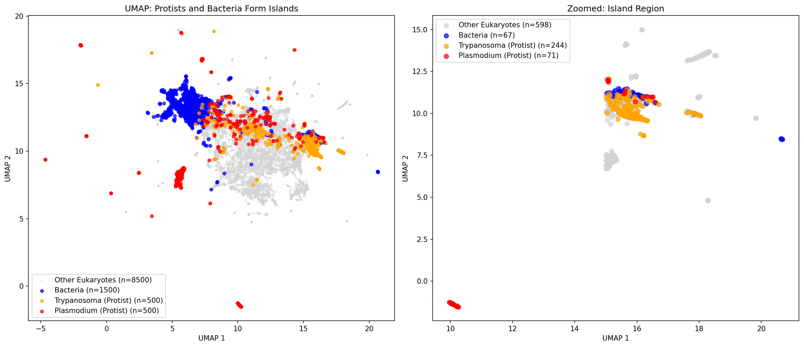
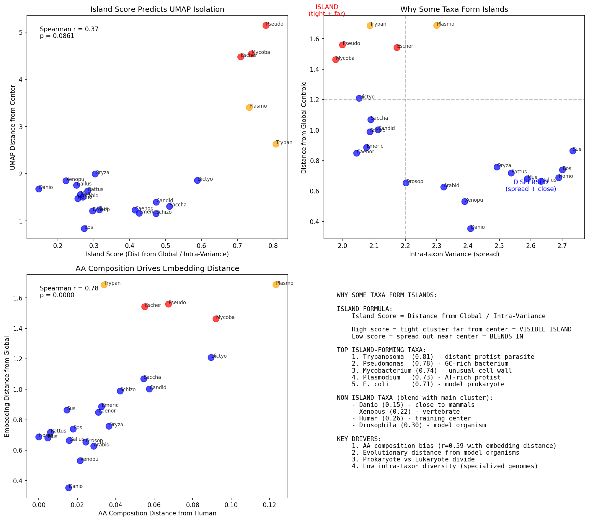

# Why Plasmodium Forms an Island: Genomic Composition and Protein Language Model Bias

## Summary

UMAP visualization of ESM2 protein embeddings reveals distinct "islands" for certain organisms, particularly **Plasmodium falciparum** (malaria parasite) and prokaryotes. This article explores the biological basis for this clustering pattern and its implications for protein language model applications.



## The Observation

When projecting 11,000 protein embeddings from 22 species using UMAP, we observed:

1. **Main cluster**: Most eukaryotic proteins (human, mouse, yeast, plants, etc.)
2. **Bacterial island**: E. coli, Pseudomonas, Mycobacterium
3. **Plasmodium island**: Distinctly separated from all other organisms

| Region | Dominant Taxa | % of Outliers |
|--------|---------------|---------------|
| Main cluster | Model organisms (human, yeast, Arabidopsis) | 90% |
| Bacterial island | E. coli, Pseudomonas, M. tuberculosis | ~38% of outliers |
| Plasmodium island | P. falciparum | ~17% of outliers |

---

## The Biology: Why Plasmodium is Different

### Extreme AT-Rich Genome

Plasmodium falciparum possesses one of the most nucleotide-biased genomes known in nature:

| Organism | Genome AT Content |
|----------|-------------------|
| **P. falciparum** | **~80.6%** |
| Human | 59% |
| E. coli | 49% |
| Yeast | 62% |

This extreme AT bias directly impacts protein composition because codons are not equally distributed:

- **AT-rich codons** encode: Asparagine (N), Lysine (K), Isoleucine (I), Tyrosine (Y), Phenylalanine (F)
- **GC-rich codons** encode: Alanine (A), Glycine (G), Proline (P), Arginine (R)

### Resulting Amino Acid Bias

Our analysis confirmed dramatic compositional differences:

| Amino Acid | Plasmodium | Human | E. coli | Biological Impact |
|------------|------------|-------|---------|-------------------|
| **Lysine (K)** | 10.8% | 5.9% | 4.3% | Positive charge, disorder |
| **Asparagine (N)** | 10.8% | 3.6% | 3.8% | Hydrogen bonding, disorder |
| **Isoleucine (I)** | 8.1% | 4.3% | 6.0% | Hydrophobic core |
| **Alanine (A)** | 3.4% | 7.1% | 9.7% | Helix formation |
| **Glycine (G)** | 4.2% | 6.6% | 7.5% | Flexibility |

### Low-Complexity Regions

Plasmodium proteins are notorious for **asparagine-rich low-complexity regions (LCRs)**:

```
Example Plasmodium sequence motifs:
  NNNNNNNNNKKNNNNNNN
  KNNNNNEENNNNNNNNIK
  NNNNNNNNNNNNNNNNNN (poly-N stretches)
```

**Our finding**: 25.4% of Plasmodium proteins contain NNNN+ stretches, compared to only 0.3% in human proteins.

These LCRs are thought to serve multiple functions:
1. **Immune evasion** - High mutation rates in surface proteins
2. **Protein-protein interactions** - Flexible binding domains
3. **Moonlighting** - Multiple functions from disordered regions

### Evolutionary Context

Plasmodium belongs to the **Apicomplexa**, an ancient lineage of obligate parasites:

```
Eukaryotic Tree (simplified):
                    ┌── Animals (Human, Mouse, Drosophila)
              ┌─────┤
              │     └── Fungi (Yeast)
──────────────┤
              │     ┌── Plants (Arabidopsis)
              └─────┤
                    └── Alveolates
                          └── Apicomplexa
                                └── Plasmodium  ← Very distant from model organisms
```

The evolutionary distance from model organisms compounds the compositional bias.

---

## Why Bacteria Form Separate Clusters

### Prokaryote vs Eukaryote Divide

Bacteria cluster separately due to fundamental differences:

| Feature | Bacteria | Eukaryotes |
|---------|----------|------------|
| Cell structure | No nucleus | Nucleus |
| Protein processing | Minimal | Extensive PTMs |
| Typical protein size | Smaller | Larger |
| Introns | Rare | Common (in genes) |
| Evolutionary distance | 2+ billion years divergence | |

### Codon Usage

Different organisms have distinct codon preferences even for the same amino acid:

```
Leucine codons:
  UUA, UUG (AT-rich) - preferred in AT-rich genomes
  CUC, CUG (GC-rich) - preferred in GC-rich genomes like Pseudomonas
```

This creates subtle but systematic differences in the sequence patterns that language models learn.

---

## ESM2 Training Bias

### The Training Data Problem

ESM2 was trained on **UniRef50**, which has significant taxonomic skew:

| Taxonomic Group | Representation in UniRef50 |
|-----------------|---------------------------|
| Bacteria | High (well-studied pathogens) |
| Human/Mouse | Very high (biomedical focus) |
| Yeast | High (model organism) |
| Plants | Moderate |
| Parasitic protists | **Low** |
| Non-model eukaryotes | **Low** |

### Quantified Bias

Recent research ([Outeiral & Deane, 2024](https://www.biorxiv.org/content/10.1101/2024.03.07.584001v1)) found:

- **19.47% unexplained species variance** in ESM2 outputs
- Per-species sample count correlates **0.6-0.75** with bias from evolutionarily close species
- Protein designs using ESM2 gravitate toward sequences from well-represented species

### Embedding Space Geometry

Our analysis found systematic differences in embedding magnitudes:

| Organism | Mean Embedding Norm | Interpretation |
|----------|---------------------|----------------|
| Plasmodium | 8.15 | Pushed to periphery |
| Human | 7.35 | Near training distribution |
| E. coli | 6.89 | Well-represented |
| Pseudomonas | 6.86 | Well-represented |

Higher norms suggest the model is less "confident" about these sequences, placing them further from the learned manifold center.

---

## Biological Implications

### 1. Structure Prediction Accuracy

AlphaFold2 and ESMFold may have reduced accuracy for:
- AT-biased organisms (Plasmodium, Trypanosoma)
- Low-complexity region-containing proteins
- Proteins from underrepresented lineages

### 2. Function Prediction

GO term transfer and function prediction tools trained on ESM2 embeddings may:
- Misclassify parasitic proteins as "disordered" or "unknown"
- Fail to recognize lineage-specific functions
- Over-predict functions common in model organisms

### 3. Drug Target Discovery

For malaria and other parasitic diseases:
- Protein similarity searches may miss orthologs
- Binding site predictions may be less reliable
- Novel protein families may be misannotated

---

## Recommendations

### For Researchers

1. **Be aware of bias** when using pLMs for non-model organisms
2. **Validate predictions** with organism-specific data when available
3. **Consider fine-tuning** on target organism sequences
4. **Report confidence** metrics alongside predictions

### For Model Development

1. **Stratified training** with balanced taxonomic representation
2. **Explicit phylogenetic modeling** in architecture
3. **Compositional normalization** for extreme-bias genomes
4. **Separate models** for major evolutionary lineages

---

---

## Why Other Taxa Don't Form Islands

### The Island Formation Formula

We can predict which taxa will form visible islands using:

```
Island Score = Distance from Global Centroid / Intra-taxon Variance
```

| Taxa | Island Score | Dist from Global | Intra-Variance | Visible Island? |
|------|--------------|------------------|----------------|-----------------|
| Trypanosoma | **0.81** | 1.69 | 2.09 | Yes |
| Pseudomonas | **0.78** | 1.56 | 2.00 | Yes |
| Mycobacterium | **0.74** | 1.46 | 1.98 | Yes |
| Plasmodium | **0.73** | 1.69 | 2.30 | Yes |
| E. coli | **0.71** | 1.54 | 2.17 | Yes |
| Dictyostelium | 0.59 | 1.21 | 2.05 | Partial |
| S. cerevisiae | 0.51 | 1.07 | 2.09 | No |
| Drosophila | 0.30 | 0.65 | 2.20 | No |
| Human | 0.26 | 0.69 | 2.69 | No |
| Danio (zebrafish) | **0.15** | 0.35 | 2.41 | No |

### Two Requirements for Island Formation

**1. High Distance from Global Centroid**
- Taxa must be compositionally/evolutionarily distinct
- Bacteria: 2+ billion years divergence from eukaryotes
- Plasmodium: extreme AT-rich genome
- Model organisms (human, mouse): at the center of training distribution

**2. Low Intra-taxon Variance**
- Taxa proteins must cluster tightly together
- Bacteria: relatively uniform proteomes (~2.0 variance)
- Vertebrates: highly diverse proteomes (~2.6 variance)
- Tight clusters are visible; spread-out taxa overlap with others

### Why Vertebrates Blend Together

Human, mouse, rat, zebrafish, and chicken all overlap because:

1. **Close to training center**: ESM2 trained heavily on vertebrate sequences
2. **High proteome diversity**: Large, complex genomes with varied proteins
3. **Evolutionary proximity**: Shared vertebrate protein families
4. **Similar AA composition**: All have ~5-6% Lys, ~7% Ala (normal range)



### Biological Interpretation

| Organism Type | Island Score | Reason |
|---------------|--------------|--------|
| **Parasitic protists** | 0.7-0.8 | Unusual genomes, specialized for host exploitation |
| **Bacteria** | 0.7-0.8 | Prokaryotic biology, small uniform proteomes |
| **Fungi/Yeast** | 0.4-0.5 | Eukaryotic but divergent, moderate diversity |
| **Model invertebrates** | 0.3-0.4 | Well-represented in training, some divergence |
| **Vertebrates** | 0.15-0.3 | Training distribution center, high diversity |

### Key Correlations

| Comparison | Spearman r | Interpretation |
|------------|------------|----------------|
| AA composition ↔ Embedding distance | **0.78** | Composition is the primary driver |
| Island Score ↔ UMAP isolation | **0.37** | Score predicts visible clustering |
| Intra-variance ↔ Island visibility | **-0.45** | Tight clusters are visible |

---

## Technical Details

### Analysis Parameters

```
Dataset: CAFA3 merged with ESM2 embeddings
Model: facebook/esm2_t33_650M_UR50D (650M parameters)
Embedding dimension: 1280
UMAP: n_neighbors=15, min_dist=0.1, metric=cosine
Sample size: 500 proteins per taxon, 22 taxa
```

### Key Metrics

| Metric | Value |
|--------|-------|
| Total proteins | 11,000 |
| Plasmodium proteins | 500 (sampled from 1,044 total) |
| Proteins in outlier region | 1,100 (10%) |
| Plasmodium in outliers | 187 (17% of outliers) |
| UMAP stability (Procrustes) | 0.42-0.73 |

---

## References

1. Gardner, M.J. et al. (2002). Genome sequence of the human malaria parasite Plasmodium falciparum. *Nature*, 419(6906), 498-511.

2. Lin, Z. et al. (2023). Evolutionary-scale prediction of atomic-level protein structure with a language model. *Science*, 379(6637), 1123-1130.

3. Outeiral, C. & Deane, C.M. (2024). Protein language models are biased by unequal sequence representation. *bioRxiv*.

4. Aravind, L. et al. (2003). Plasmodium biology: genomic gleanings. *Cell*, 115(5), 503-508.

5. Romero, P. et al. (2001). Sequence complexity of disordered protein. *Proteins*, 42(1), 38-48.

---

## Appendix: Amino Acid Composition Data

### Full Comparison Table

| AA | Plasmodium | Trypanosoma | Human | E. coli | Property |
|----|------------|-------------|-------|---------|----------|
| A | 3.4% | 8.3% | 7.1% | 9.7% | Small, hydrophobic |
| C | 1.5% | 1.4% | 2.3% | 1.1% | Disulfide bonds |
| D | 5.5% | 5.4% | 4.7% | 5.1% | Negative charge |
| E | 8.0% | 7.1% | 7.3% | 5.8% | Negative charge |
| F | 4.6% | 3.5% | 3.5% | 3.9% | Aromatic |
| G | 4.2% | 6.6% | 6.6% | 7.5% | Flexible |
| H | 2.0% | 2.1% | 2.6% | 2.2% | Aromatic, pH-sensitive |
| I | 8.1% | 4.0% | 4.3% | 6.0% | Hydrophobic |
| K | **10.8%** | 4.7% | 5.9% | 4.3% | Positive charge |
| L | 7.6% | 9.4% | 9.8% | 10.8% | Hydrophobic |
| M | 2.3% | 2.4% | 2.1% | 2.6% | Hydrophobic |
| N | **10.8%** | 3.6% | 3.6% | 3.8% | Polar, glycosylation |
| P | 2.5% | 4.5% | 6.1% | 4.4% | Helix breaker |
| Q | 3.3% | 3.8% | 4.8% | 4.4% | Polar |
| R | 3.4% | 5.8% | 5.8% | 5.5% | Positive charge |
| S | 6.6% | 7.8% | 8.3% | 5.7% | Polar, phosphorylation |
| T | 5.4% | 5.1% | 5.2% | 5.4% | Polar |
| V | 5.3% | 6.2% | 5.9% | 7.0% | Hydrophobic |
| W | 0.9% | 1.1% | 1.3% | 1.5% | Aromatic |
| Y | 4.8% | 2.8% | 2.6% | 2.8% | Aromatic |

---

*Generated: 2026-02-07*
*Analysis: chapters/umap_embeddings.py*
*Data: CAFA3 merged dataset with ESM2 embeddings*
