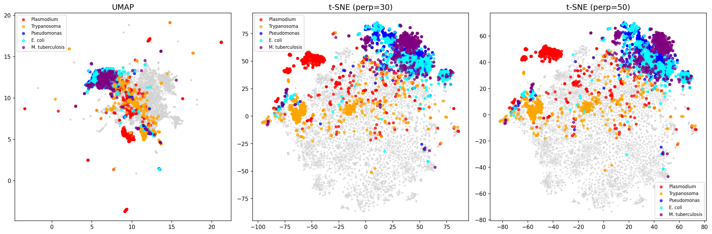
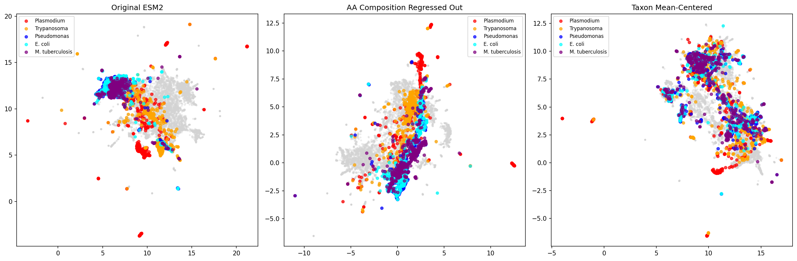

# Formal Metrics and Semantic Embeddings

## Formalized Distance and Variance Metrics

### Notation

```
X ∈ ℝ^{n×d}         Embedding matrix (n proteins, d=1280 dimensions)
x_i ∈ ℝ^d           Embedding vector for protein i
T_k                 Set of proteins belonging to taxon k
|T_k|               Number of proteins in taxon k
```

### Taxon Centroid

```
μ_k = (1/|T_k|) Σ_{i∈T_k} x_i
```

The mean embedding of all proteins from taxon k.

### Global Centroid

```
μ_global = (1/n) Σ_i x_i
```

The mean embedding across all proteins.

### Distance from Global Centroid

```
D_k = ||μ_k - μ_global||_2
```

**Interpretation**: How far taxon k's average embedding is from the overall average. High D_k indicates the taxon is "unusual" in embedding space.

### Intra-Taxon Variance

```
V_k = (1/|T_k|) Σ_{i∈T_k} ||x_i - μ_k||_2
```

**Interpretation**: Average L2 distance of proteins from their taxon centroid. Low V_k means tight cluster; high V_k means dispersed.

### Island Score

```
I_k = D_k / V_k
```

**Interpretation**: Ratio of "how far" to "how spread".
- High I_k → visible island (far from center AND tightly clustered)
- Low I_k → blends in (either close to center OR too spread out)

---

## What UMAP and t-SNE Project

### Input Space

```
X ∈ ℝ^{n×1280}
```

ESM2 mean-pooled embeddings: each protein is a 1280-dimensional vector representing the average of all token embeddings from the last layer.

### Output Space

```
Y ∈ ℝ^{n×2}
```

2D coordinates for visualization.

### UMAP Objective

```
Minimize: Σ_{i,j} [w_ij · log(w_ij/v_ij) + (1-w_ij) · log((1-w_ij)/(1-v_ij))]
```

Where:
- `w_ij` = fuzzy set membership (similarity) in high-D, based on k-NN graph
- `v_ij` = similarity in low-D, based on distances in Y

**Properties**:
- Preserves both local AND global structure
- O(n log n) complexity
- More stable than t-SNE

### t-SNE Objective

```
Minimize: KL(P || Q) = Σ_{i,j} p_ij · log(p_ij / q_ij)
```

Where:
- `p_ij` = Gaussian similarity in high-D: p_ij ∝ exp(-||x_i - x_j||² / 2σ²)
- `q_ij` = Student-t similarity in low-D: q_ij ∝ (1 + ||y_i - y_j||²)^{-1}

**Properties**:
- Excellent local structure preservation
- Distorts global distances (clusters can appear equidistant)
- Sensitive to perplexity parameter

### Comparison Results

| Taxon | UMAP I_k | t-SNE(30) I_k | t-SNE(50) I_k |
|-------|----------|---------------|---------------|
| Mycobacterium | 3.04 | 2.63 | 2.60 |
| E. coli | 2.08 | 1.95 | 2.08 |
| Pseudomonas | 1.94 | 2.61 | 3.01 |
| Trypanosoma | 0.82 | 0.90 | 0.94 |
| Plasmodium | 0.53 | 1.62 | 1.65 |

**Correlation**: Spearman r = 1.00 (perfect rank agreement)

Both methods identify the same taxa as forming islands. t-SNE with higher perplexity increases island visibility for some taxa.

---

## Syntactic vs Semantic Embeddings

### The Problem

ESM2 embeddings capture both:

| Type | Features | Example |
|------|----------|---------|
| **Syntactic** | AA composition, sequence patterns, codon bias, length | Plasmodium's high Asn/Lys content |
| **Semantic** | Structure, function, evolutionary relationships | Kinase domain similarity |

The "islands" we observe are largely **syntactic** - driven by unusual amino acid composition.

### Quantifying the Syntactic Signal

We regressed out amino acid composition from embeddings:

```python
# AA composition vector (20 dimensions)
AA_i = [freq(A), freq(C), ..., freq(Y)] for protein i

# Predict embeddings from AA composition
X_predicted = Ridge.fit(AA, X).predict(AA)

# Residual = semantic signal
X_semantic = X - X_predicted
```

**Result**:
```
Original embedding variance:     0.0451
After removing AA composition:   0.0041
Variance explained by AA:        90.9%
```

**Critical finding**: ~91% of ESM2 embedding variance is explainable by amino acid composition alone!

### Approaches to Extract Semantic Signal

#### 1. Regress Out AA Composition

```
X_semantic = X - f(AA)
```

Where f is a linear (Ridge) or non-linear (MLP) predictor.

**Effect on Island Scores**:

| Taxon | Original | AA-Regressed |
|-------|----------|--------------|
| Mycobacterium | 3.04 | 0.78 |
| E. coli | 2.08 | 1.03 |
| Plasmodium | 0.53 | 0.87 |

Reduces taxonomic clustering but doesn't eliminate it.

#### 2. Mean-Center Per Taxon

```
X_centered[i] = X[i] - μ_{taxon(i)}
```

Removes taxon-level bias entirely. Reveals within-taxon functional diversity.

#### 3. Contrastive Learning (Requires Retraining)

```
Loss = -log(sim(anchor, positive) / (sim(anchor, positive) + Σ sim(anchor, negative)))
```

Where:
- `positive` = protein with same GO terms from different taxon
- `negative` = proteins with different functions

This would force the model to learn function-invariant representations.

#### 4. Use Structure-Based Embeddings

Instead of sequence embeddings, use:
- ESMFold latent representations
- AlphaFold2 structure embeddings
- 3Di alphabet (Foldseek)

Structure is more conserved than sequence across evolutionary distance.

---

## Summary Table

| Approach | Removes Syntactic? | Preserves Semantic? | Effort |
|----------|-------------------|---------------------|--------|
| AA regression | Partial (91% variance) | Yes | Easy |
| Taxon centering | Complete | Partial | Easy |
| Contrastive fine-tuning | Yes | Yes (optimized) | High |
| Structure embeddings | Yes | Yes | Medium |

---

## Recommendations

### For Visualization
- Always test multiple projection methods (UMAP, t-SNE with different perplexity)
- Consider AA-regressed embeddings if studying function across taxa

### For Function Prediction
- Be aware that taxonomic signal dominates
- Fine-tune on GO terms or use multi-task learning
- Consider taxa-stratified evaluation

### For Orthology Detection
- The syntactic signal may actually help (orthologs share composition)
- But for distant orthologs, use structure-based methods

### For Drug Target Discovery
- Don't trust raw similarity scores for cross-species comparisons
- Use domain-level embeddings rather than full-protein

---

## Figures





---

*Generated: 2026-02-08*
*Analysis: chapters/umap_embeddings.py*
