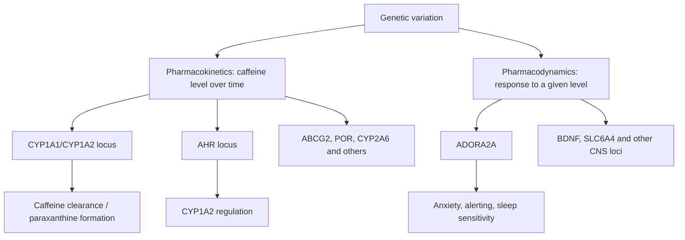

# Caffeine Sensitivity Genetics

## Summary

Genetic caffeine sensitivity is not one thing. The literature separates into two broad axes:

- **Pharmacokinetics:** how fast caffeine is absorbed, metabolized, and cleared. The strongest signals are around **CYP1A1/CYP1A2** and **AHR**.
- **Pharmacodynamics:** how strongly a given caffeine level affects the brain/body. The clearest candidate-gene signal is **ADORA2A**, especially for anxiety and sleep sensitivity.

In plain language:

> CYP1A2/AHR help explain "how long caffeine stays in me"; ADORA2A helps explain "how wired/anxious/sleep-disrupted I feel at a given caffeine level."

These are probabilistic effects, not destiny. Dose, timing, tolerance, sleep debt, smoking, medications, sex, ancestry, liver function, pregnancy, and beverage type can all change the real-world response.

## GWAS Primer

A **GWAS** is a genome-wide association study: researchers scan many genetic variants across the genome and test which variants are statistically associated with a trait.

For caffeine, the trait is often imperfectly measured:

- cups of coffee per day,
- total caffeine intake,
- plasma caffeine or caffeine metabolites,
- response to an acute caffeine dose,
- self-reported anxiety or sleep disruption after caffeine.

This matters because "coffee intake" is not identical to "caffeine sensitivity." It also includes taste, habit, culture, access, beverage size, decaf reporting, smoking, and non-caffeine coffee chemistry.

Official background: [NHGRI GWAS definition](https://www.genome.gov/genetics-glossary/Genome-Wide-Association-Studies).

## High-Level Map

## Pharmacokinetic Loci

| Locus / variant | What it points to | Best-supported interpretation |
|---|---|---|
| **CYP1A1/CYP1A2**, especially `rs2472297` / nearby variants | caffeine metabolism and xenobiotic metabolism | one of the strongest and most replicated coffee/caffeine consumption loci |
| **AHR**, including `rs4410790` and `rs6968865` | aryl hydrocarbon receptor regulation of CYP1A genes | affects inducibility/regulation of caffeine-metabolizing pathways |
| **CYP1A2 rs762551** | CYP1A2 enzyme inducibility/activity | commonly used as a fast/slow metabolism marker, but effects are context-dependent |
| **ABCG2** | transporter biology | appears in larger coffee-consumption GWAS as a pharmacokinetic-related locus |
| **POR** | cytochrome P450 electron-transfer partner | supports caffeine/drug metabolism biology |
| **CYP2A6** | secondary caffeine metabolism | weaker than CYP1A2/AHR, but appears in caffeine metabolite GWAS |

## CYP1A2 / AHR Axis

**CYP1A2** is the major liver enzyme for caffeine metabolism. **AHR** helps regulate CYP1A gene expression. This is why GWAS hits near both genes are coherent: one locus points to the enzyme; the other points to its regulation.

Repeated GWAS findings:

- `rs2472297` near CYP1A1/CYP1A2 is associated with higher coffee consumption.
- `rs4410790` near AHR is associated with habitual caffeine intake.
- `rs6968865` near AHR was reported in early coffee-consumption GWAS.
- Caffeine metabolite GWAS link the CYP1A2/AHR axis to systemic caffeine levels.

Interpretation:

- Faster metabolism can lower circulating caffeine for the same intake.
- People who clear caffeine faster may drink more to get the desired effect.
- People who clear caffeine slowly may feel effects longer and may drink less.

## CYP1A2 rs762551: Useful but Easy to Overstate

`rs762551` is often used in consumer genetics as the "fast vs slow caffeine metabolizer" SNP.

Common simplified framing:

- `AA`: often labeled faster CYP1A2 inducibility/metabolism.
- `AC` or `CC`: often labeled slower metabolism.

But be careful:

- rs762551 is not the only determinant of CYP1A2 activity.
- Smoking can induce CYP1A2 and change caffeine clearance.
- Oral contraceptives, pregnancy, liver disease, age, diet, and medications can modify caffeine metabolism.
- Some studies find strong genotype effects; others find context-, ancestry-, sex-, or phenotype-dependent effects.

The right use in this project is not "this genotype proves sensitivity." It is:

> rs762551 is a candidate covariate for caffeine clearance, especially when paired with actual intake timing, plasma caffeine/metabolites, smoking, medication, and sleep data.

## Pharmacodynamic Loci

| Locus / variant | What it points to | Best-supported interpretation |
|---|---|---|
| **ADORA2A rs5751876** | adenosine A2A receptor biology | associated in challenge studies with caffeine-induced anxiety and sleep/alerting sensitivity |
| **ADORA1 / ADORA2A interaction** | receptor system cross-talk | adenosine receptor variants can relate to brain receptor availability and sleep-related caffeine response |
| **DRD2 variants** | dopamine receptor interaction | caffeine's A2A effects interact with dopamine signaling, especially in striatal circuits |
| **BDNF** | neuroplasticity and CNS function | appears in coffee-consumption GWAS as a possible pharmacodynamic locus |
| **SLC6A4** | serotonin transporter | appears in larger GWAS as a brain/behavioral pharmacodynamic candidate |

## ADORA2A and Feeling "Sensitive"

ADORA2A encodes the A2A adenosine receptor, one of caffeine's major brain targets. Candidate-gene studies have repeatedly focused on `rs5751876`.

Reported associations include:

- caffeine-induced anxiety after acute caffeine challenge,
- caffeine-related sleep disruption or altered sleep EEG measures,
- interaction with habitual caffeine use,
- possible sex/context effects in some studies.

The best mental model:

> ADORA2A variants may alter how strongly the brain reacts to caffeine's receptor blockade, even if caffeine blood levels are the same.

This is different from CYP1A2/AHR, which mostly shape how much caffeine remains in circulation over time.

## Coffee Consumption GWAS Is Not the Same as Sensitivity

Many loci associated with coffee intake probably reflect a mixture of:

- faster or slower metabolism,
- reward and reinforcement,
- sleep disruption avoidance,
- taste preference,
- smoking and other substance-use correlations,
- cultural beverage patterns,
- non-caffeine compounds in coffee.

The Coffee and Caffeine Genetics Consortium found loci that split into plausible pharmacokinetic candidates such as ABCG2, AHR, POR, CYP1A2 and pharmacodynamic candidates such as BDNF and SLC6A4. Newer 23andMe/UK Biobank work also emphasizes that cohort and culture can change which associations appear or how they relate to other traits.

## Sensitivity Phenotypes to Track Separately

For this project, do not use one undifferentiated "caffeine sensitivity" variable. Separate:

| Phenotype | Likely biology |
|---|---|
| plasma caffeine half-life | CYP1A2/AHR, liver metabolism, smoking, medications |
| paraxanthine/caffeine ratio | CYP1A2 activity |
| habitual coffee intake | metabolism + behavior + culture + taste |
| anxiety after caffeine | ADORA2A, dopamine interaction, baseline anxiety, tolerance |
| sleep disruption after caffeine | ADORA2A, clearance rate, timing, sleep debt |
| blood pressure/heart response | clearance + autonomic sensitivity + cardiovascular state |
| performance/ergogenic response | dose, timing, CYP1A2, training state, tolerance |

## Epigenome Project Implications

The genetics suggests a two-part strategy:

1. **Metabolism layer:** map CYP1A2, AHR, POR, ABCG2, and CYP2A6 expression/regulatory state across liver and other relevant cells.
2. **Response layer:** map ADORA receptor expression, ADORA regulatory accessibility, and downstream cAMP/CREB/NFAT programs across brain, immune, vascular, and other responsive cell types.

The most useful integrative analyses:

- test whether caffeine GWAS variants overlap liver enhancers near CYP1A2/AHR,
- test whether ADORA2A sensitivity variants lie in cell-type-specific regulatory contexts,
- connect GTEx eQTLs for CYP1A2/AHR/ADORA2A to tissue-specific expression,
- distinguish coffee-intake loci from plasma-caffeine loci,
- use caffeine-response datasets such as Findley/Boye to see whether variants alter regulatory response.

## Caveats

- Most GWAS are enriched for European-ancestry cohorts; portability across ancestries is not guaranteed.
- Consumer-genetics interpretations often overstate single SNP effects.
- Habitual intake is a behavioral trait, not a clean pharmacology assay.
- Coffee, tea, energy drinks, and pure caffeine should not be collapsed without thought.
- "Sensitive" can mean anxious, sleepless, jittery, high blood pressure, long half-life, or strong performance response; these may have different genetics.

## Key Sources

- [NHGRI GWAS definition](https://www.genome.gov/genetics-glossary/Genome-Wide-Association-Studies)
- [Cornelis et al. 2011, GWAS of caffeine intake: AHR and CYP1A2 loci](https://pmc.ncbi.nlm.nih.gov/articles/PMC3071630/)
- [Sulem et al. 2011, CYP1A1/CYP1A2 and AHR coffee consumption loci](https://pmc.ncbi.nlm.nih.gov/articles/PMC3080612/)
- [Amin et al. 2012, CYP1A1/CYP1A2 and coffee drinking](https://pmc.ncbi.nlm.nih.gov/articles/PMC3482684/)
- [Coffee and Caffeine Genetics Consortium 2015, six novel coffee loci](https://pubmed.ncbi.nlm.nih.gov/25288136/)
- [Cornelis et al. 2016, caffeine metabolite GWAS](https://academic.oup.com/hmg/article/25/24/5472/2581117)
- [Alsene et al. 2003, ADORA2A and caffeine-induced anxiety](https://www.nature.com/articles/1300232)
- [Childs et al. 2008, ADORA2A/DRD2 and caffeine-induced anxiety](https://pmc.ncbi.nlm.nih.gov/articles/PMC2745641/)
- [Rogers et al. 2010, ADORA2A/ADORA1, anxiety, alerting, habitual use](https://pmc.ncbi.nlm.nih.gov/articles/PMC3055635/)
- [Thorpe et al. 2024, cohort-specific coffee GWAS](https://pmc.ncbi.nlm.nih.gov/articles/PMC11319477/)
- [Systematic review of caffeine intake/metabolism genetics](https://translational-medicine.biomedcentral.com/articles/10.1186/s12967-024-05737-z)

Related pages: [GWAS, EWAS, and pharmacogenomics](gwas-ewas-pharmacogenomics.md), [adenosine receptors](adenosine-receptors.md), [cAMP signaling](camp-signaling.md), [caffeine cultural history](caffeine-cultural-history.md), [cell type response model](cell-type-response-model.md)

