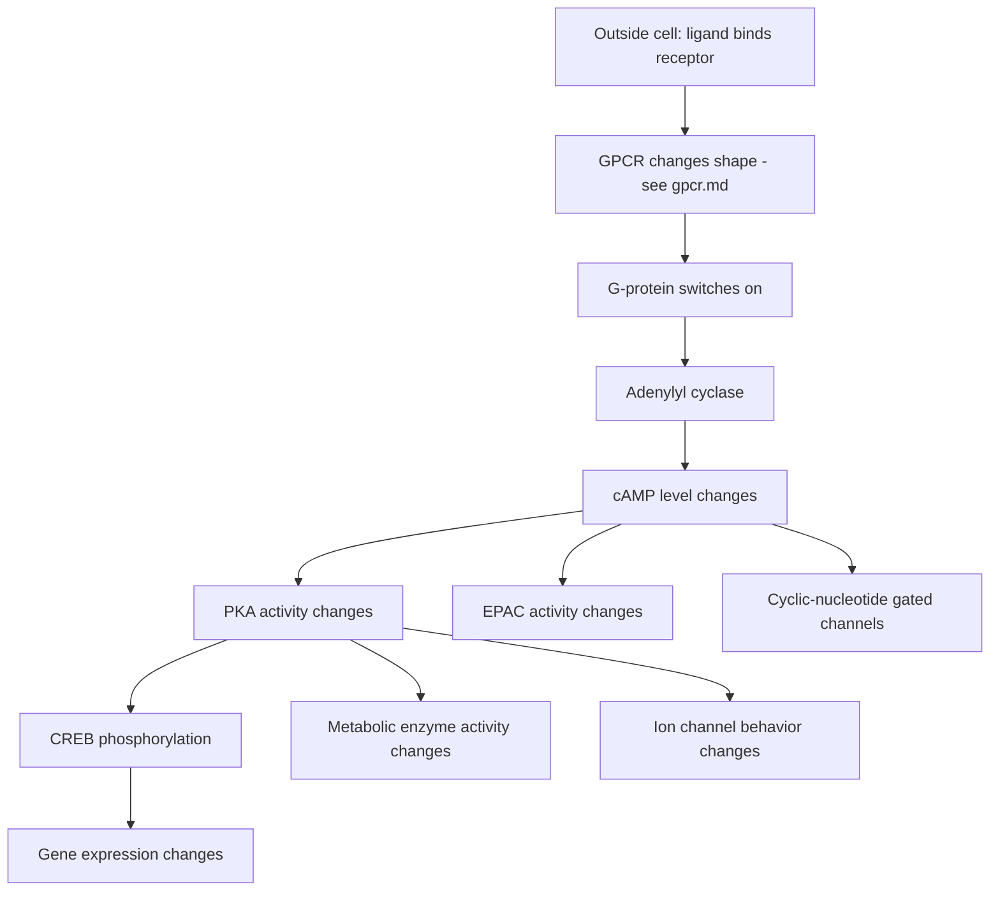
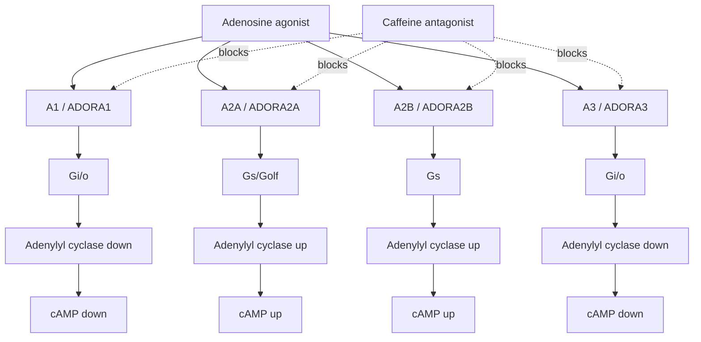

# cAMP Signaling and ADORA Cascades

## Summary

**cAMP** means **cyclic adenosine monophosphate**. It is a small intracellular **second messenger**: a molecule cells make inside themselves to carry a signal from a receptor at the membrane to enzymes, ion channels, transcription factors, and sometimes the nucleus.

cAMP is **not unique to caffeine** and not unique to adenosine receptors. Many receptors change cAMP. Caffeine matters because adenosine receptors are one important receptor family that uses cAMP, and caffeine blocks those receptors.

The kind of diagram you are asking for is usually called a **signal transduction cascade** or **signaling pathway schematic**.

## One Big Picture

Read it as: receptor signal outside the cell becomes a cAMP signal inside the cell, then cAMP changes protein activity and sometimes gene regulation.

## What cAMP Is Doing

cAMP is a temporary internal signal. It is made from ATP by **adenylyl cyclase** and broken down by **phosphodiesterases**.

If adenylyl cyclase is turned up, cAMP rises. If phosphodiesterases are inhibited, cAMP also tends to stay high longer.

## The ADORA Receptor Cascades

| Receptor gene | Protein shorthand | Main G-protein coupling | When adenosine binds | What caffeine does |
|---|---|---|---|---|
| [ADORA1](adenosine-receptors.md) | A1 | [Gi/o](g-protein-coupling.md) | lowers adenylyl cyclase activity, usually lowering cAMP | blocks that lowering signal, so cAMP can be relatively higher than it would be under adenosine |
| [ADORA2A](adenosine-receptors.md) | A2A | [Gs/Golf](g-protein-coupling.md) | raises adenylyl cyclase activity, usually raising cAMP | blocks that raising signal, so cAMP can be relatively lower through this receptor |
| [ADORA2B](adenosine-receptors.md) | A2B | [Gs](g-protein-coupling.md), sometimes other branches | raises cAMP, especially in stress/high-adenosine contexts | blocks that raising signal through A2B |
| [ADORA3](adenosine-receptors.md) | A3 | [Gi/o](g-protein-coupling.md) | lowers cAMP and can engage other branches | blocks that lowering signal |

The important move: caffeine does not have one universal "increase cAMP" or "decrease cAMP" effect. The sign depends on which receptor subtype dominates in that cell.

## Receptor-Specific Schematic

## Why Blocking Can Look Like Opposite Effects

If adenosine binds A1 or A3, it usually lowers cAMP. Caffeine blocks that. So caffeine can **remove a cAMP-lowering signal**.

If adenosine binds A2A or A2B, it usually raises cAMP. Caffeine blocks that. So caffeine can **remove a cAMP-raising signal**.

That means caffeine's net effect depends on:

- which ADORA receptor subtypes the cell expresses,
- how much adenosine is around,
- whether the cell also has other receptors changing cAMP,
- how active phosphodiesterases are,
- cell type and state.

## cAMP Is Not Unique to Caffeine

cAMP is a general-purpose signaling currency. Many receptors use it. Examples:

| Receptor family | Example ligand | Typical cAMP direction |
|---|---|---|
| beta-adrenergic receptors | adrenaline/noradrenaline | raises cAMP through [Gs](g-protein-coupling.md) |
| glucagon receptor | glucagon | raises cAMP through [Gs](g-protein-coupling.md) |
| dopamine D1-like receptors | dopamine | raises cAMP through [Gs](g-protein-coupling.md) |
| dopamine D2-like receptors | dopamine | lowers cAMP through [Gi/o](g-protein-coupling.md) |
| many odorant receptors | odor molecules | raise cAMP in olfactory neurons |
| some serotonin receptors | serotonin | can raise or lower cAMP depending on subtype |

So cAMP is more like a shared internal signaling wire than a caffeine-specific pathway.

## What cAMP Does Inside the Cell

Major cAMP effectors:

| Effector | What cAMP does | Why it matters |
|---|---|---|
| PKA | cAMP activates protein kinase A | PKA phosphorylates many proteins, changing metabolism, ion channels, and transcription |
| CREB | PKA can phosphorylate CREB | CREB can turn on gene-expression programs |
| EPAC | cAMP activates exchange proteins directly activated by cAMP | affects small GTPase signaling, cell adhesion, secretion, and other context-specific processes |
| CNG channels | cAMP can open cyclic-nucleotide gated channels | important in sensory and electrical signaling contexts |

## From cAMP to Epigenomics

cAMP itself does not "edit chromatin." Instead:

1. cAMP changes PKA and related effector activity.
2. PKA and other pathways phosphorylate transcription factors such as CREB.
3. Transcription factors recruit coactivators such as CBP/p300.
4. Coactivators can modify histones and increase enhancer/promoter activity.
5. The result can show up as expression changes, H3K27ac changes, accessibility changes, or motif activity changes.

## Minimal Mental Model

Do not memorize every arrow yet. Keep this:

> Receptors change G-proteins. G-proteins change adenylyl cyclase. Adenylyl cyclase changes cAMP. cAMP changes PKA/CREB and other effectors. Caffeine blocks adenosine's access to ADORA receptors, so it changes whichever cAMP signals those receptors would have produced.

Related pages: [GPCR](gpcr.md), [G-protein](g-protein.md), [G-protein coupling](g-protein-coupling.md), [kinase](kinase.md), [adenosine receptors](adenosine-receptors.md), [pharmacology vocabulary](pharmacology-vocabulary.md), [caffeine molecular targets](caffeine-molecular-targets.md), [signaling to transcription](signaling-to-transcription.md), [secondary caffeine targets](secondary-caffeine-targets.md)
