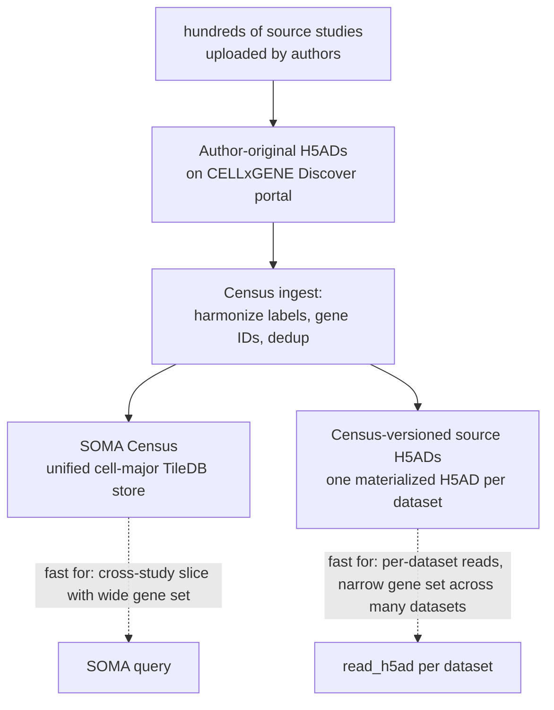

# Census Source H5ADs

## Summary

The same biological data is published in two physical forms:

| Form | Where | Optimized for |
|---|---|---|
| **SOMA Census** | one big TileDB-SOMA store on S3 (`s3://cellxgene-census-public-us-west-2/cell-census/<version>/soma/`) | "give me a slice across many source studies in one query" |
| **Source H5ADs** | one H5AD per source dataset on S3 (`s3://cellxgene-data-public/cell-census-public-data/h5ads/<dataset_id>.h5ad` for the Census-released copy) | "give me one whole dataset at a time" |

They are not different data; they are different **projections** of the same data — built from the same ingested studies, with the same `dataset_id` provenance, but stored to support different access patterns.

This page exists because Lab 001 spent two long fetches discovering that the SOMA route is the wrong tool for our access pattern, and the source-H5AD route is the right one. See [001 fetch stall post-mortem](../labs/001-fetch-stall-postmortem.md), [TileDB-SOMA storage](tiledb-soma-storage.md), and the probe result on 2026-06-01 (10h 39m to fetch 11 cells from SOMA).

## Why The Two Forms Exist

The CZ CELLxGENE Discover portal hosts hundreds of independently submitted single-cell datasets. Each one was uploaded by its authors as an H5AD with their own choices of cell-type labels, gene IDs, normalization, etc.

The Census team **ingests** those H5ADs into a single unified SOMA store with:

- harmonized cell-type vocabulary (CL terms),
- harmonized tissue terms (UBERON),
- harmonized assay terms (EFO),
- gene symbols mapped to Ensembl IDs across builds,
- duplicate cells flagged via `is_primary_data`,
- a single global `soma_joinid` row index across all studies.

That ingestion is the value of the SOMA Census: you can query across studies as if they were one experiment.

The trade-off is the physical storage layout that makes Lab 001's "few genes, all cells" query the worst case. See [TileDB-SOMA storage](tiledb-soma-storage.md) for why.

The source H5ADs the team **also publishes** are a Census-versioned copy of each ingested dataset — same cells, same gene IDs, same harmonized cell-type/tissue labels in `obs`, but stored one dataset at a time as a flat materialized cells × genes matrix. No fragment walking. You download one file and `anndata.read_h5ad()` it.

## How To Find A Source H5AD

Two complementary entry points:

**1. The `datasets` DataFrame inside Census.** Every Census release exposes it under `census["census_info"]["datasets"]`. The relevant columns include:

| Column | Meaning |
|---|---|
| `dataset_id` | stable UUID for the source dataset |
| `dataset_h5ad_path` | path to the source H5AD artifact (under the Census public bucket) |
| `dataset_total_cell_count` | total cells contributed by that dataset |
| `collection_id` | UUID for the containing CELLxGENE Discover collection |
| `dataset_title` | human-readable title |

So `s3://cellxgene-census-public-us-west-2/cell-census/<version>/h5ads/<dataset_h5ad_path>` (path conventions vary by release) gives you the per-dataset file.

**2. The convenience helper `cellxgene_census.get_source_h5ad_uri(dataset_id)`.** This returns a dict with the canonical S3 URI of the source H5AD for that dataset, pinned to the Census version. There is also `cellxgene_census.download_source_h5ad(dataset_id, to_path=...)` which downloads it for you.

The same dataset is also available in its original-author form via the CELLxGENE Discover portal API, but those copies are **not** version-pinned to a Census release, so cell counts and labels may differ. Always prefer the Census-versioned copies when you need them to line up with `obs` joins.

## When To Use Which Form

| If your access pattern is... | Use |
|---|---|
| "all primary normal brain cells across every dataset, give me 4 genes" | SOMA Census — but only if the gene/cell ratio justifies fragment walks (it does not for 4 genes). For Lab 001, source H5ADs are faster. |
| "fetch one source dataset's full transcriptome, do per-dataset QC" | source H5AD per `dataset_id` |
| "I want to do a population-level integration across hundreds of studies and have the gene set is wide" | SOMA Census |
| "I have a sparse gene list and want to scan across many datasets" | source H5ADs in parallel, extract the gene columns locally, concatenate |

The Lab 001 case sits in the last row. Each brain dataset's H5AD is bounded in size, locally `read_h5ad`-able, and lets us extract `adata[:, ['ADORA1','ADORA2A','ADORA2B','ADORA3']]` in seconds per file.

## Costs To Budget For

| What | Order of magnitude | Notes |
|---|---|---|
| One typical source H5AD | 100 MB – 5 GB | grows with cell count and densely stored layers |
| One large atlas H5AD (e.g. Tabula Sapiens, Allen Brain) | 10 – 50 GB | a few outliers dominate disk |
| All brain source H5ADs (186 datasets in the 2025-11-08 release) | rough order: 80 – 200 GB total | confirm empirically before downloading; see [001 data flow](../labs/001-data-flow.md) for the planned size-check pass |
| Full Census homo_sapiens SOMA mirror | ~700 GB – 1.5 TB | downloading it locally does **not** speed up queries; same fragment layout |

The local lab disk has ~200 GB free at the time of writing, which fits "brain source H5ADs" approximately, with no margin for the SOMA mirror.

## Mental Model

## What This Page Does Not Cover

- The exact S3 URI conventions for every Census release (they have shifted; resolve via `get_source_h5ad_uri` rather than hand-building paths).
- The Discover portal's own download API, which is not version-pinned to a Census release.
- Source H5AD schema details (`obs` columns, `var` columns, normalization choices) — those live in the [001 H5AD and AnnData cache](../labs/001-h5ad-anndata-cache.md) page and CELLxGENE's schema docs.

Related pages: [TileDB-SOMA storage](tiledb-soma-storage.md), [001 CellxGene Census API](../labs/001-cellxgene-census-api.md), [001 H5AD and AnnData cache](../labs/001-h5ad-anndata-cache.md), [001 data flow](../labs/001-data-flow.md), [001 fetch stall post-mortem](../labs/001-fetch-stall-postmortem.md), [public data landscape](public-data-landscape.md)
