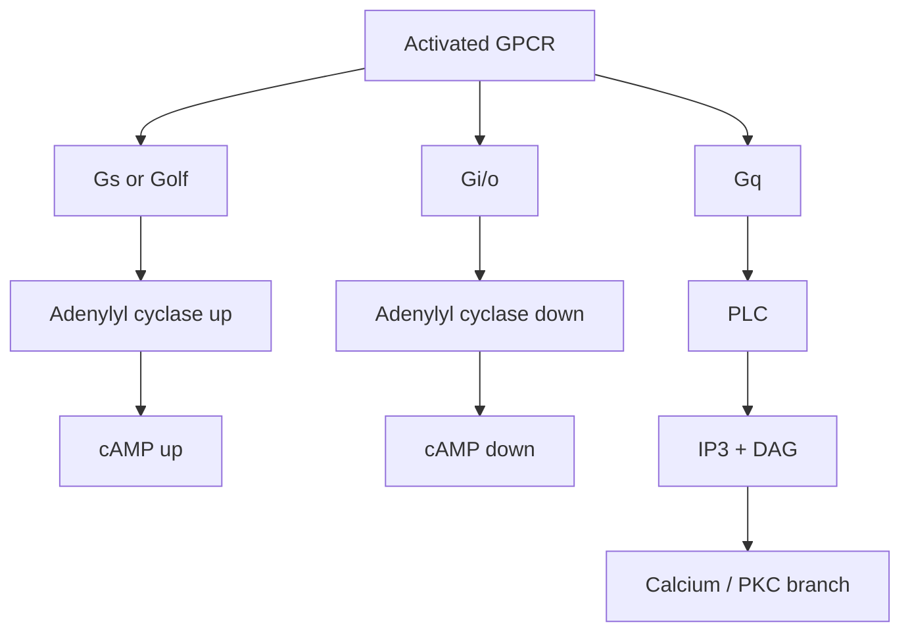

# G-Protein Coupling

## Summary

**G-protein coupling** describes which intracellular [G-protein](g-protein.md) a [GPCR](gpcr.md) uses after a ligand activates it. This matters because different G-protein classes push the cell into different signaling modes.

For the caffeine project, the key decoder is:

- **Gs** raises cAMP.
- **Gi/o** lowers cAMP.
- **Golf** is Gs-like and raises cAMP in specific sensory/neural contexts.
- **Gq** is a different branch that mainly signals through PLC, IP3/DAG, calcium, and PKC rather than cAMP.

## Terms

| Term | Read it as | Main pathway | cAMP effect |
|---|---|---|---|
| [GPCR](gpcr.md) | G-protein-coupled receptor | receptor activates a G-protein | depends on G-protein type |
| Gs | G-stimulatory | stimulates adenylyl cyclase | cAMP up |
| Gi/o | G-inhibitory / Go family | inhibits adenylyl cyclase; can also affect ion channels | cAMP down |
| Golf | G-olfactory | Gs-like; important in olfactory neurons and striatal neurons | cAMP up |
| Gq | G-q | activates PLC -> IP3/DAG -> calcium/PKC | not mainly a cAMP branch |

## ADORA Coupling

| Receptor | Main coupling | When adenosine activates it |
|---|---|---|
| [ADORA1 / A1](adenosine-receptors.md) | Gi/o | lowers cAMP |
| [ADORA2A / A2A](adenosine-receptors.md) | Gs/Golf | raises cAMP |
| [ADORA2B / A2B](adenosine-receptors.md) | Gs, sometimes other branches | raises cAMP; can have context-specific branches |
| [ADORA3 / A3](adenosine-receptors.md) | Gi/o | lowers cAMP |

## Tiny Schematic

## Why This Matters for Caffeine

Caffeine blocks adenosine from activating ADORA receptors. It therefore blocks whichever G-protein branch adenosine would have triggered.

That is why caffeine can look like it raises cAMP in A1/A3-dominated cells but lowers the adenosine-driven cAMP signal in A2A/A2B-dominated cells.

Related pages: [GPCR](gpcr.md), [G-protein](g-protein.md), [G-protein switching mechanics](g-protein-switching.md), [cAMP signaling and ADORA cascades](camp-signaling.md), [adenosine receptors](adenosine-receptors.md), [pharmacology vocabulary](pharmacology-vocabulary.md), [signaling to transcription](signaling-to-transcription.md)

