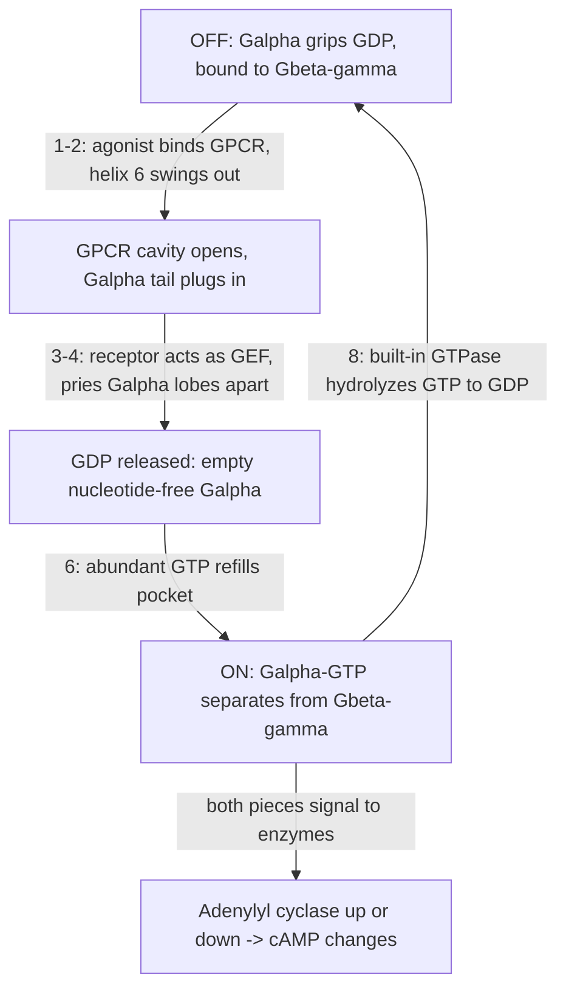

# G-Protein Switching Mechanics

## Summary

This page answers one question: **how does a [GPCR](gpcr.md) mechanically toggle a [G-protein](g-protein.md) on?**

The short version: the receptor is a **lever, not a pump**. It does not push GDP out, pull GTP in, or spend energy. It just pops the lid off the G-protein's nucleotide pocket so the spent GDP can leave and abundant GTP can take its place. The formal name for this role is a **GEF** (guanine-nucleotide exchange factor).

Scope: [g-protein.md](g-protein.md) covers *what* the switch is and its GDP/GTP states; this page covers the *mechanical act* of flipping it; [g-protein-coupling.md](g-protein-coupling.md) covers *which* Gα flavor and the cAMP direction.

## The Core Idea: Exchange, Not Pumping

A [G-protein](g-protein.md) sits OFF while its Gα subunit grips **GDP**. The hard, slow step in turning it on is letting that GDP *go* — Gα clamps it tightly. The receptor's entire job is to make that release easy. Once the pocket is empty, the cell's chemistry finishes the job: there is roughly ten times more **GTP** than GDP floating in the cytosol, so an empty pocket simply refills with GTP. The receptor never "chooses" GTP — concentration does. That is why this is called nucleotide *exchange*.

## The Toggle, Step by Step

1. **Ligand binds outside.** An agonist (adenosine) docks in the [orthosteric pocket](pharmacology-vocabulary.md) on the outer face of the receptor.
2. **The shape change crosses the membrane.** Because the [GPCR](gpcr.md) is one connected [7-transmembrane](gpcr.md) bundle, squeezing the outside pocket shifts the helices on the inside. The signature move is transmembrane helix 6 swinging **outward**, opening a cavity on the receptor's inner face — the [conformational change](pharmacology-vocabulary.md).
3. **The G-protein plugs in.** The Gα tail (its C-terminal α5 helix) inserts into that newly opened cavity like a key into a slot.
4. **That contact pries Gα open.** Gα is two lobes clamped around the GDP. Receptor docking levers the lobes **apart**, loosening the grip.
5. **GDP falls out.** The spent [GDP](pharmacology-vocabulary.md) drifts away, leaving a briefly empty ("nucleotide-free") G-protein held by the receptor. *This release is the rate-limiting step — exactly the one the receptor accelerates.*
6. **GTP rushes in.** Because [GTP](pharmacology-vocabulary.md) is far more abundant, it refills the empty pocket on its own.
7. **GTP snaps the switch on.** The extra phosphate clamps Gα's mobile "switch regions" into a new shape. In that shape Gα no longer likes the receptor *or* Gβγ, so it lets go of both: Gα·GTP and free Gβγ separate and go signal.
8. **Auto-reset.** Gα's built-in [GTPase](pharmacology-vocabulary.md) eventually [hydrolyzes](pharmacology-vocabulary.md) GTP back to GDP; Gα re-clamps, rejoins Gβγ, and waits to be toggled again.

## The Cycle

## Why One Receptor Toggles Many

Because the receptor only lowers the barrier and then lets go, a single activated [GPCR](gpcr.md) can toggle **many** G-proteins one after another before the ligand leaves. One signal in becomes many switches flipped — built-in amplification, and a reason the response is sensitive to even modest ligand levels.

## Why This Matters for Caffeine

Caffeine is an [antagonist](pharmacology-vocabulary.md): it fills the orthosteric pocket but does **not** trigger step 2. No helix-6 swing means the inner cavity never opens, Gα is never pried, GDP never leaves. The lever is simply not pulled. Caffeine does not switch the G-protein *off* — it prevents adenosine from switching it *on*, so whichever [cAMP signal](camp-signaling.md) that receptor would have produced never fires. See [caffeine molecular targets](caffeine-molecular-targets.md).

Related pages: [G-protein](g-protein.md), [GPCR](gpcr.md), [G-protein coupling](g-protein-coupling.md), [cAMP signaling](camp-signaling.md), [adenosine receptors](adenosine-receptors.md), [pharmacology vocabulary](pharmacology-vocabulary.md)
