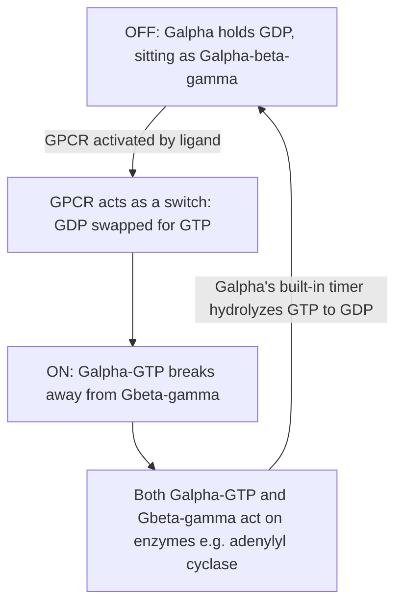

# G-Protein (the molecular switch)

## Summary

A **G-protein** is a protein that acts as an on/off **switch** just inside the cell membrane. A [GPCR](gpcr.md) flips that switch when a ligand binds; the switched-on G-protein then turns nearby enzymes up or down, which changes a [second messenger](pharmacology-vocabulary.md) like [cAMP](camp-signaling.md).

The "G" stands for **guanine-nucleotide-binding**: the switch is held in its "off" or "on" position by which small molecule it is gripping — **GDP** (off) or **GTP** (on). That is the whole trick.

This page owns "what the G-protein *is* and how its switch works." For *which* G-protein flavor a receptor uses and what that does to cAMP, see [G-protein coupling](g-protein-coupling.md).

## The Three Parts

The G-proteins in this project are **heterotrimeric** — one protein made of three subunits:

| Subunit | Plain role |
|---|---|
| **Gα** (alpha) | The business end. It holds the GDP/GTP and decides whether the switch is off or on. Its flavor (Gs, Gi/o, Gq…) is what [G-protein coupling](g-protein-coupling.md) is about |
| **Gβ** (beta) | Pairs tightly with Gγ |
| **Gγ** (gamma) | Pairs tightly with Gβ |

At rest, all three sit together as one unit (Gα-Gβγ), parked under the receptor.

## The On/Off Cycle

This is the part that makes "G-protein" feel mysterious until you see it as a four-step loop:

Step by step:

1. **OFF** — Gα is gripping **GDP**, and the three subunits sit together, doing nothing.
2. **Receptor flips it** — when a ligand activates the [GPCR](gpcr.md), the receptor pries open Gα and lets it swap its GDP for **GTP**. (The receptor is doing the swapping, which is why a receptor with no ligand keeps the switch off.)
3. **ON** — Gα-GTP changes shape and **breaks away** from Gβγ. Now *both* pieces are free to bump into target enzymes and change their activity. This is the actual signal.
4. **Auto-shutoff** — Gα has a **built-in timer**: it slowly chews its own GTP back down to GDP, which switches it off and lets it re-join Gβγ, ready for the next cycle.

The switch is self-resetting. That is why the signal is temporary: remove the ligand and the G-proteins drift back to the OFF state on their own.

For the mechanical detail of *how* the receptor actually does the GDP→GTP swap (it acts as a lever, not a pump), see [G-protein switching mechanics](g-protein-switching.md).

## How This Connects to the "Coupling" Labels

The Gi/o, Gs, Golf, and Gq labels you see in the [adenosine receptors](adenosine-receptors.md) cheat sheet are just **different Gα flavors**. Same switch mechanism, different downstream target:

- **Gs / Golf** Gα turns adenylyl cyclase **up** → cAMP up.
- **Gi/o** Gα turns adenylyl cyclase **down** → cAMP down.
- **Gq** Gα uses a different enzyme (PLC) and the calcium branch instead.

So "the receptor couples to Gi/o" just means "this receptor flips a G-protein whose Gα is the kind that lowers cAMP." Full decoder: [G-protein coupling](g-protein-coupling.md).

## Why This Matters for Caffeine

Caffeine is an [antagonist](pharmacology-vocabulary.md): it sits in the receptor pocket without activating it. So the [GPCR](gpcr.md) never pries Gα open, the GDP→GTP swap never happens, and the G-protein switch **stays OFF**. Caffeine does not flip any switch itself — it prevents adenosine from flipping the ones it normally would. Whatever signal those G-proteins would have sent simply does not fire. See [cAMP signaling](camp-signaling.md) for what is downstream.

Related pages: [G-protein switching mechanics](g-protein-switching.md), [GPCR](gpcr.md), [G-protein coupling](g-protein-coupling.md), [cAMP signaling](camp-signaling.md), [adenosine receptors](adenosine-receptors.md), [pharmacology vocabulary](pharmacology-vocabulary.md), [caffeine molecular targets](caffeine-molecular-targets.md)
