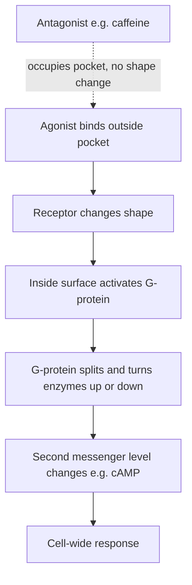

# GPCR (G-Protein-Coupled Receptor)

## Summary

A **GPCR** is a receptor protein that sits in the cell membrane, detects a signal molecule on the outside, and relays that signal to the inside of the cell through an attached **G-protein**. They are the largest receptor family in the human genome (~800 genes) and the target of roughly a third of all approved drugs.

This page owns the "what is a GPCR" concept. For *which* G-protein a given receptor uses and what that does to cAMP, see [G-protein coupling](g-protein-coupling.md); for the downstream cAMP cascade, see [cAMP signaling](camp-signaling.md). All four adenosine receptors caffeine acts on are GPCRs.

## The Architecture

A GPCR is a single protein chain that crosses the membrane **seven times**, which is why they are also called **7-transmembrane (7TM)** receptors.

- The weaving back and forth creates a **binding pocket on the outside** where a [ligand](pharmacology-vocabulary.md) docks.
- It also creates a surface on the **inside** that contacts the [G-protein](g-protein-coupling.md).
- The receptor's job is to carry news *across* the membrane: a signal molecule that cannot enter the cell triggers an effect inside it.

| Property | Plain meaning |
|---|---|
| 7-transmembrane / 7TM | The protein snakes across the membrane seven times |
| Orthosteric site | The main outside pocket where the natural ligand binds (where adenosine and caffeine compete) |
| Conformational change | The receptor physically changes shape when activated — that shape change is the signal |
| Coupled | "Linked to" — the receptor is functionally attached to a G-protein on the inside |

## The Activation Cycle

Read it as: a ligand binds → the receptor changes shape → that flips the [G-protein](g-protein.md) → the G-protein changes an enzyme → a [second messenger](pharmacology-vocabulary.md) like [cAMP](camp-signaling.md) changes → the cell responds. An [antagonist](pharmacology-vocabulary.md) sits in the pocket *without* triggering the shape change, so the chain never starts.

## Why GPCRs Matter

- **Scale:** ~800 human GPCRs detect light, odors, tastes, hormones, neurotransmitters, and more.
- **Druggability:** the outside pocket is easy to target with small molecules, so GPCRs are among the most common drug targets (beta-blockers, antihistamines, opioids, and caffeine all act on GPCRs).
- **Versatility:** the *same* receptor architecture produces different effects depending on which [G-protein it couples to](g-protein-coupling.md) — that is how one family covers so many jobs.

## Adenosine Receptors Are GPCRs

The four [adenosine receptors](adenosine-receptors.md) (ADORA1, ADORA2A, ADORA2B, ADORA3) are all GPCRs. The "Coupling" column in their cheat sheet — Gi/o, Gs, Gs/Golf — names *which* G-protein each one is wired to, which sets whether [cAMP](camp-signaling.md) goes up or down. See [G-protein coupling](g-protein-coupling.md) for that decoder.

## Why This Matters for Caffeine

Caffeine works by parking in the outside binding pocket of these GPCRs so adenosine cannot bind. Because it is an [antagonist](pharmacology-vocabulary.md), it occupies the pocket *without* causing the shape change — so the G-protein is never flipped and the adenosine signal never fires. Caffeine does not push a new signal; it blocks an existing one. See [caffeine molecular targets](caffeine-molecular-targets.md).

Related pages: [G-protein](g-protein.md), [G-protein switching mechanics](g-protein-switching.md), [G-protein coupling](g-protein-coupling.md), [cAMP signaling](camp-signaling.md), [adenosine receptors](adenosine-receptors.md), [pharmacology vocabulary](pharmacology-vocabulary.md), [caffeine molecular targets](caffeine-molecular-targets.md), [signaling to transcription](signaling-to-transcription.md)
