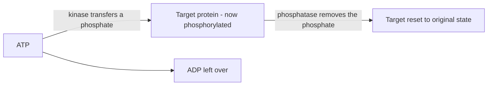
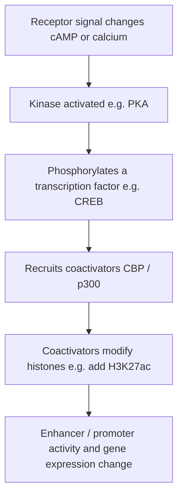

# Kinase

## Summary

A **kinase** is an enzyme that attaches a **phosphate group** onto another molecule — almost always a protein. That act is called [phosphorylation](pharmacology-vocabulary.md), and it is the cell's most common fast on/off switch for protein activity.

Kinases matter to this project because they are the hinge between the membrane-signaling world (a [GPCR](gpcr.md) changing [cAMP](camp-signaling.md)) and the gene-regulation world ([transcription factors](pharmacology-vocabulary.md) turning genes on). Caffeine's effect on adenosine signaling ultimately reaches the genome *through* kinases.

## What a Kinase Does, Mechanically

1. A kinase grabs **ATP** — the cell's energy currency, which carries three phosphate groups.
2. It snips off the **last phosphate** and transfers it onto a specific spot (usually a serine, threonine, or tyrosine) on a target protein. The leftover ATP becomes **ADP**.
3. That phosphate is bulky and strongly negatively charged, so it **changes the target's shape** — switching it on, switching it off, or changing what it binds.

Think of the phosphate as a sticky note that says "active now" (or "inactive now") slapped onto the protein.

## It Is Reversible: the Writer / Eraser Pair

A kinase only adds the tag. The opposite enzyme — a **phosphatase** — removes it and resets the protein. This push/pull is the whole point:

| Enzyme | Action | Effect |
|---|---|---|
| Kinase | adds a phosphate (phosphorylation) | flips the switch |
| Phosphatase | removes the phosphate (dephosphorylation) | resets the switch |

Because the tag is fast to add, fast to remove, and needs no new protein to be made, phosphorylation is ideal for relaying a signal *quickly* and then *shutting it off* — exactly what a transient signal like a caffeine-altered cAMP pulse needs.

## Kinase Cascades

Signaling pathways are often just kinases phosphorylating the next kinase down the line — a **cascade**. Each step can activate many copies of the next, so a small input is amplified into a large response by the time it reaches the genome. The [signaling to transcription](signaling-to-transcription.md) page lays out the specific cascades relevant here.

## Kinases in This Project

| Kinase | Switched on by | Main job here |
|---|---|---|
| **PKA** (protein kinase A) | [cAMP](camp-signaling.md) | The big one. cAMP activates PKA, which phosphorylates CREB and many metabolic/ion-channel targets |
| **CaMKII** | calcium / calmodulin | Calcium branch; drives HDAC export and MEF2/NFAT-linked programs |
| **MAPK / ERK** | growth and stress inputs | Phosphorylates CREB, AP-1, and other factors; immediate-early gene activation |
| **PI3K → Akt** | growth-factor inputs | Feeds the mTOR / growth and autophagy branch |

(PI3K is technically a lipid kinase — it phosphorylates a membrane lipid rather than a protein — but the same "add a phosphate to flip a switch" logic applies.)

## From Kinase to Epigenome

This is why a kinase belongs in an *epigenome* project. The membrane signal becomes a gene-regulation signal here:

So a kinase is the step that converts "a chemical signal arrived at the membrane" into "the cell changed which genes it reads." Phosphorylation of a transcription factor is one of the main routes by which caffeine-altered signaling can leave an epigenomic footprint.

## Why This Matters for Caffeine

Caffeine blocks adenosine at its [GPCRs](gpcr.md), changing the [cAMP](camp-signaling.md) signal a cell would otherwise have had. Because cAMP gates **PKA**, that change is felt as more or less PKA activity — and therefore more or less phosphorylation of CREB and PKA's other targets. The kinase is where caffeine's receptor-level action becomes a concrete change in protein activity and, downstream, gene regulation.

Related pages: [cAMP signaling](camp-signaling.md), [signaling to transcription](signaling-to-transcription.md), [pharmacology vocabulary](pharmacology-vocabulary.md), [G-protein coupling](g-protein-coupling.md), [caffeine molecular targets](caffeine-molecular-targets.md), [epigenomics vocabulary](epigenomics-vocabulary.md)
