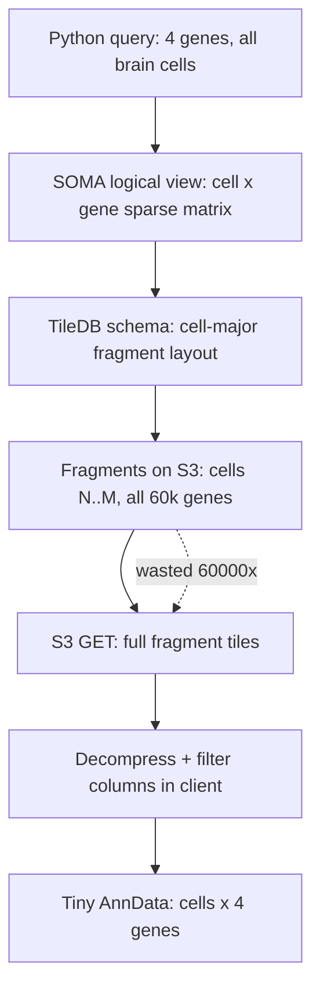

# TileDB-SOMA Storage

## Summary

The CZ CELLxGENE Census is not a file. It is a **TileDB-SOMA object** stored as many small files in an S3 bucket. SOMA, "Stack Of Matrices, Annotated", is the in-memory data model. **TileDB** is the on-disk and on-S3 storage engine that holds the bytes.

Understanding this layer matters because the layout of the bytes on S3 decides which queries are fast and which queries are slow. A query that looks trivial in Python ("give me four genes across all human brain cells") can pull a much larger amount of data from S3 than the size of the answer would suggest. This page explains why.

For how the Python API sits on top of this layer, see [001 CellxGene Census API](../labs/001-cellxgene-census-api.md). For the logical relationship between `obs`, `var`, `soma_joinid`, and `X`, see [SOMA axes and X](soma-axes-and-x.md). For the file we produce *after* the query, see [001 H5AD and AnnData cache](../labs/001-h5ad-anndata-cache.md). For the concrete incident motivating this page, see [001 fetch stall post-mortem](../labs/001-fetch-stall-postmortem.md) and the underlying [raw evidence](../raw/lab-001-stall-postmortem.md).

## The SOMA Data Model

A SOMA `Experiment` contains, per organism:

| Component | Role |
|---|---|
| `obs` | one row per cell, with metadata columns such as `cell_type`, `tissue`, `dataset_id`, `donor_id` |
| `ms["RNA"].var` | one row per gene, with metadata such as `feature_id` and `feature_name` |
| `ms["RNA"].X["raw"]` | a sparse **cell x gene** expression matrix |
| `ms["RNA"].X["normalized"]` | an alternative pre-normalized layer (Census also ships this) |

The two axes are the **observation axis** (cells) and the **variable axis** (genes). Each cell is identified by a `soma_joinid` that indexes into `obs`. Each gene is identified by a `soma_joinid` that indexes into `var`.

`X` is a sparse matrix at the SOMA level: it stores `(cell_id, gene_id, value)` triples, not a dense table.

## TileDB Sparse Arrays

TileDB stores a sparse array as many **fragments**. Each fragment is a small chunk of `(cell_id, gene_id, value)` triples written together at one point in time. The full array on S3 is a directory that contains:

| Object | Role |
|---|---|
| `__schema/` | array schema: dimension names, types, tile extents, filter pipeline |
| `__fragments/` | one subdirectory per fragment, each holding tile data |
| `__commits/` | append-only log of which fragments are part of the current view |
| `__meta/` | array-level metadata |

A query against the array becomes:

1. consult `__schema/` and `__commits/` to know which fragments are visible,
2. for each fragment, decide whether its **bounding box** could contain any matching cells,
3. for each candidate fragment, fetch the relevant tile files from S3,
4. decompress the tiles,
5. filter out rows and columns that do not match the user filter,
6. concatenate the surviving triples into the result.

Two things follow from this.

- **A fragment is the unit of S3 read.** Even when only four genes are needed, the fragment files that overlap the query must be fetched and decompressed.
- **TileDB filters at decompression time, not at fetch time.** The work to skip unwanted columns happens after the bytes are already in memory.

## How Census X Is Partitioned

CZ CELLxGENE Census builds the human RNA matrix in a streaming, append-mostly fashion across hundreds of source datasets. Each source contributes one or more fragments that span a contiguous range of `soma_joinid` cells across **all** genes.

In other words, fragments are **cell-major**: a fragment is "cells N to M, all genes for those cells", not "all cells, genes G to H".

That partitioning matches the dominant access pattern of the broader scRNA community, which is: pick a population of cells, look at their full transcriptome.

It does not match the access pattern of Lab 001, which is the opposite: pick a tiny gene set, look at it across many cells.

## Why "Few Genes, Many Cells" Is The Worst Case

Lab 001 asks for four genes across every normal brain cell in the Census. Because fragments are cell-major:

1. Every fragment that contains any brain cell must be fetched.
2. Each such fragment contains data for all ~60,000 genes for those cells.
3. The query filter "feature_name in [4 genes]" only excludes rows after the fragment is already downloaded and decompressed.
4. So the network cost is proportional to **cells fetched x 60,000**, not **cells fetched x 4**.

The compute cost is similar: TileDB must walk and decompress most of each fragment to find the cells, even though only four columns survive filtering.

This is why the per-`dataset_id` `get_anndata` call in our fetch script took 11 hours for dataset 1 and 3 hours for dataset 2 with no retries firing, despite the final AnnData being tiny. See [001 fetch stall post-mortem](../labs/001-fetch-stall-postmortem.md) for the timing evidence.

## What `var_value_filter` Actually Does

`cellxgene_census.get_anndata(..., var_value_filter="feature_name in [...]")` is documented as a "filter pushed down to SOMA". This is true in the sense that the resulting AnnData contains only those four genes. It is **not** true in the sense that S3 only sends bytes for those four genes.

Pushdown works on **dimension coordinates** that match the array's partitioning. Because Census X is partitioned by cell ranges, only obs-side filters (and only the ones that reduce the contiguous cell range you read) actually reduce S3 traffic. A gene-name filter shrinks the answer but not the read.

## What `obs_value_filter` Does Better

An obs filter such as `tissue_general == 'brain'` does reduce the set of fragments that must be read, but only at the granularity that the cell-major fragment layout allows. If brain cells from different source datasets are scattered across many fragments, all those fragments are still touched.

Two access patterns are markedly more efficient than "one tissue, all genes filter":

| Pattern | Why it is better |
|---|---|
| narrow `obs_value_filter` per call (e.g. `cell_type == 'astrocyte' and tissue_general == 'brain'`) | the fragment set is tighter; fewer wasted reads |
| native streaming iterator (`ExperimentAxisQuery.X("raw").tables()` or `read_iter()`) | overlaps S3 fetch with downstream work; lets us write per-chunk caches that survive interruption |

Lab 001's first fetch implementation chose the wrong granularity: "one tissue, one dataset_id". That asks TileDB to read most of one source dataset to extract four columns, no matter how small the source dataset is in cell count.

## Mental Model

The dotted line is the cost-of-this-layout: the bytes that travel down the wire are roughly 60,000 times the bytes that survive into the answer, because column selection happens after fragment decompression.

## Practical Implications For Lab 001

1. **Do not chunk by `dataset_id`.** A whole source dataset is too coarse and the gene filter does not reduce S3 traffic anyway. See [001 data flow](../labs/001-data-flow.md) and [001 fetch stall post-mortem](../labs/001-fetch-stall-postmortem.md).
2. **Chunk inside the obs axis along labels that reduce the cell set the query actually walks.** `cell_type`-by-`cell_type`, or batched by `soma_joinid` ranges via the native iterator.
3. **Prefer `ExperimentAxisQuery` + `X("raw").tables()` or `.read_iter()`** so chunks land as `pyarrow` tables and can be appended to a per-chunk on-disk cache without holding everything in memory.
4. **If even sub-tissue chunks are too slow,** consider trading the Census for a pre-published atlas where the matrix has already been materialized for the cells of interest (HCA brain release files, Tabula Sapiens H5AD, Zhang 2021 snATAC release, etc.).
5. **Measure, do not guess.** Use [network and I/O instrumentation](network-and-io-instrumentation.md) so the next slow run produces evidence (bandwidth, request count, request size) instead of just elapsed time.

## What This Page Does Not Cover

- The Census version compatibility story (pinning `census_version=...`).
- The `is_primary_data` deduplication semantics.
- The relation between Census, the CZ CELLxGENE Discover portal, and individual dataset H5ADs.
- TileDB-SOMA fragment compaction (the Census team periodically rewrites fragments to improve query patterns; we cannot rely on that schedule).

Each of those deserves its own page if it becomes load-bearing for the project.

Related pages: [001 CellxGene Census API](../labs/001-cellxgene-census-api.md), [SOMA axes and X](soma-axes-and-x.md), [001 H5AD and AnnData cache](../labs/001-h5ad-anndata-cache.md), [001 data flow](../labs/001-data-flow.md), [001 fetch stall post-mortem](../labs/001-fetch-stall-postmortem.md), [network and I/O instrumentation](network-and-io-instrumentation.md), [public data landscape](public-data-landscape.md)
