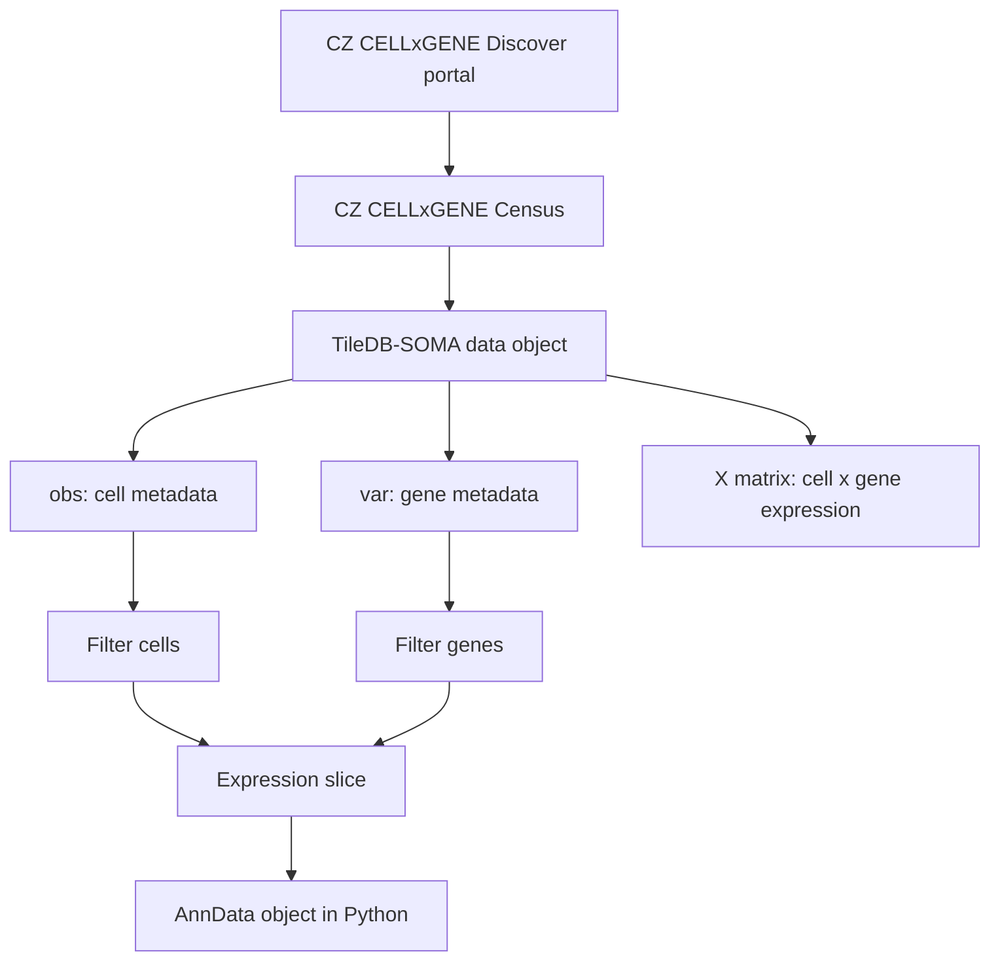

# Lab 001: CellxGene Census API

## Summary

Lab 001 uses the **CZ CELLxGENE Discover Census** through the `cellxgene_census` Python package. The Census is a versioned data object and API for querying standardized single-cell RNA data from CZ CELLxGENE Discover without manually downloading and harmonizing hundreds of source datasets.

In this lab, we use it to answer one narrow question:

> Which human cell types express [ADORA](../concepts/adenosine-receptors.md) receptor genes?

## Who Built This

CZ CELLxGENE is a single-cell data platform from the **Chan Zuckerberg Initiative**. CZI describes CZ CELLxGENE as a platform for scientists to access, analyze, and annotate high-dimensional single-cell data at scale.

Useful official sources:

- [CZ CELLxGENE Census documentation](https://chanzuckerberg.github.io/cellxgene-census/)
- [Census data and schema](https://chanzuckerberg.github.io/cellxgene-census/cellxgene_census_docsite_schema.html)
- [Learning about the Census notebook](https://chanzuckerberg.github.io/cellxgene-census/notebooks/analysis_demo/comp_bio_census_info.html)
- [CZI Cell Science tools and funding page](https://chanzuckerberg.com/science/programs-resources/single-cell-biology/)

## What the API Is

The `cellxgene_census` Python package is a convenience layer around **TileDB-SOMA**. SOMA stands for **stack of matrices, annotated**. That name is literal: the data are organized as matrices plus cell and gene annotations. For the object vocabulary behind paths such as `Collection`, `DataFrame`, `Experiment`, and `soma_joinid`, see [Census core objects](../concepts/census-core-objects.md). For how those matrices are physically partitioned on S3 and which query shapes that layout favors, see [TileDB-SOMA storage](../concepts/tiledb-soma-storage.md).

The API gives us:

- metadata queries: "which cells/datasets/tissues exist?"
- gene metadata queries: "which gene symbols and Ensembl IDs are in the Census?"
- expression matrix slicing: "give me these genes for these cells"
- export into familiar Python objects such as `AnnData`

## Mental Model



## What `open_soma()` Does

In the notebook:

```python
census = cellxgene_census.open_soma()
```

This opens the Census object. It does not mean "download the whole Census." It gives the notebook a handle to query remote, versioned data.

The script version builds a Census default context, then layers timeout settings on top:

```python
ctx = cellxgene_census.get_default_soma_context(tiledb_config={...})
cellxgene_census.open_soma(context=ctx)
```

This matters. A raw `tiledbsoma.SOMATileDBContext(...)` can bypass `cellxgene_census` defaults such as unsigned anonymous S3 requests, making even `open_soma()` much slower. Custom settings should be layered onto `get_default_soma_context(...)`.

## The Important Top-Level Paths

| Path | Meaning |
|---|---|
| `census["census_info"]["summary"]` | high-level Census summary metadata |
| `census["census_info"]["datasets"]` | dataset-level metadata |
| `census["census_data"]["homo_sapiens"]` | human data object |
| `census["census_data"]["homo_sapiens"].obs` | cell metadata |
| `census["census_data"]["homo_sapiens"].ms["RNA"].var` | gene metadata for the RNA measurement |

For a fuller walkthrough of the keys under the human experiment, see [Census experiment tree](../concepts/census-experiment-tree.md). For column glossaries, see [Census obs columns](../concepts/census-obs-columns.md), [Census var columns](../concepts/census-var-columns.md), and [Census X layers and feature presence](../concepts/census-x-layers-and-feature-presence.md).

## How Datasets Map To Cells

`census["census_info"]["datasets"]` is the dataset catalog for the whole Census. It is a remote SOMA dataframe stored under `census_info`, not a local pandas dataframe until we materialize it:

```python
datasets = (
    census["census_info"]["datasets"]
    .read()
    .concat()
    .to_pandas()
)
```

This table has one row per source dataset, with columns such as:

| Column | Meaning |
|---|---|
| `dataset_id` | stable UUID for the source dataset |
| `collection_id` | UUID for the CELLxGENE Discover collection containing the dataset |
| `collection_name` | human-readable collection title |
| `dataset_title` | human-readable dataset title |
| `dataset_h5ad_path` | path to the source H5AD artifact |
| `dataset_total_cell_count` | total cells in that source dataset |

The expression data live elsewhere, under `census_data/<organism>`. For human cells:

```python
human = census["census_data"]["homo_sapiens"]
human.obs
human.ms["RNA"].X["raw"]
```

`human.obs` has one row per cell. Its `dataset_id` column is the bridge back to `census_info["datasets"]`.

```text
census_info["datasets"]        census_data["homo_sapiens"].obs
one row per source dataset      one row per human cell

dataset_id  <----------------  dataset_id
title, DOI, h5ad path           tissue, cell_type, donor_id, disease, ...
```

So the key join is `dataset_id`, not `soma_joinid`. The `soma_joinid` in the datasets table is just that table's internal row coordinate; the `soma_joinid` in `obs` is the cell-axis coordinate used to align cells with `X`.

For example, after an AnnData query that includes `dataset_id` in `obs_column_names`, we can annotate result cells with source dataset titles:

```python
dataset_meta = datasets[
    ["dataset_id", "collection_name", "dataset_title", "dataset_total_cell_count"]
]

adata.obs = adata.obs.merge(dataset_meta, on="dataset_id", how="left")
```

Important distinction: a dataset is a biological/source-data provenance unit, not a TileDB fragment. TileDB fragments are physical storage chunks under the hood; datasets are the published source studies/files whose cells were harmonized into the Census.

There is also a separate physical projection of each dataset: the **source H5AD**, a materialized cells × genes file published per `dataset_id`. The `dataset_h5ad_path` column above points to it. For queries with a narrow gene set across many datasets — like Lab 001 — that route is dramatically cheaper than walking SOMA fragments. See [Census source H5ADs](../concepts/census-source-h5ads.md).

## What `get_anndata()` Does

In the notebook/script, the key call is:

```python
cellxgene_census.get_anndata(
    census=census,
    organism="Homo sapiens",
    measurement_name="RNA",
    var_value_filter="feature_name in ['ADORA1','ADORA2A','ADORA2B','ADORA3']",
    obs_value_filter="tissue_general == 'brain' and disease == 'normal'",
    obs_column_names=["cell_type", "tissue", "tissue_general", "assay", "dataset_id", "donor_id"],
)
```

Read this as:

- organism: human cells only,
- measurement: RNA expression,
- gene filter: only the four ADORA genes,
- cell filter: only selected cells, such as normal brain cells,
- obs columns: bring along the metadata needed for grouping and sanity checks.

The returned object is an `AnnData`.

## What AnnData Is

`AnnData` is the standard Python object used by Scanpy and many single-cell workflows.

For this lab:

| AnnData slot | Meaning here |
|---|---|
| `adata.X` | sparse cell x gene expression matrix for the selected ADORA genes |
| `adata.obs` | cell metadata, one row per cell |
| `adata.var` | gene metadata, one row per gene |

So if `adata.shape == (200000, 4)`, that means 200,000 cells and four genes.

When the fetch script calls `adata.write_h5ad(...)`, that in-memory AnnData object is serialized as a local `.h5ad` file. The notebook can later reopen it with `anndata.read_h5ad(...)` without calling the live Census API. For the file layout and cache behavior, see [H5AD and AnnData cache](001-h5ad-anndata-cache.md).

## Why This API Is Useful Here

Without the Census, we would need to:

- identify many separate human tissue datasets,
- download each dataset,
- normalize metadata names,
- harmonize cell type labels,
- map gene IDs,
- concatenate matrices,
- track provenance.

The Census does much of that standardization upfront. Lab 001 can therefore focus on the biological question: where are ADORA receptors expressed?

Related pages: [Lab 001 overview](001-adora-expression.md), [Lab 001 data flow](001-data-flow.md), [H5AD and AnnData cache](001-h5ad-anndata-cache.md), [Census core objects](../concepts/census-core-objects.md), [Census experiment tree](../concepts/census-experiment-tree.md), [ADORA receptors](../concepts/adenosine-receptors.md), [TileDB-SOMA storage](../concepts/tiledb-soma-storage.md), [001 fetch stall post-mortem](001-fetch-stall-postmortem.md)
