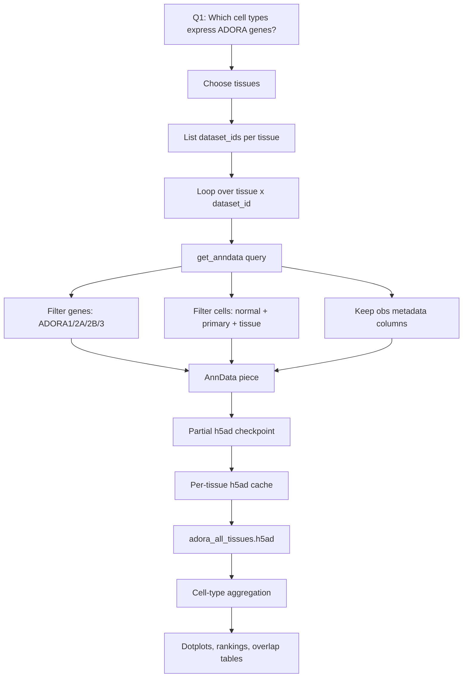

# Lab 001: Data Flow

## Summary

Lab 001 downloads a very small slice of a very large single-cell atlas: expression of four [ADORA](../concepts/adenosine-receptors.md) genes across selected normal human tissues.

The point is not to download every gene or every dataset. The point is to build a cell-type-by-receptor map that can seed later chromatin and perturbation analyses.

## What We Download

The script downloads:

- cells from selected `tissue_general` categories,
- only cells marked `is_primary_data == True`,
- only cells marked `disease == 'normal'`,
- only the RNA measurement,
- only four genes: `ADORA1`, `ADORA2A`, `ADORA2B`, `ADORA3`,
- only selected cell metadata columns.

Default tissues:

- brain
- heart
- liver
- adipose tissue
- kidney
- blood
- intestine
- lung

## What We Do Not Download

The lab does not download:

- all genes,
- raw FASTQ files,
- raw count outputs from every source study,
- ATAC-seq,
- histone ChIP-seq,
- methylation,
- disease cells,
- non-primary duplicate cells.

That restraint is intentional. Q1 only needs receptor expression.

## Data Flow Schematic



## Why Chunk by `dataset_id` (Original Rationale)

A direct "give me all normal brain cells for these four genes" query can still be large because the cell axis is huge. The first version of the script listed dataset IDs for each tissue and fetched one dataset at a time.

Intended benefits:

- easier retries,
- smaller streaming chunks,
- partial progress survives network failures,
- failed datasets do not kill the whole tissue.

> **Note (2026-05-31).** Empirically this chunking choice was wrong. Brain's first two datasets took 11h and 3h respectively in the 2026-05-31 overnight run, before any checkpoint fired. Root cause: the Census `X` matrix is partitioned **cell-major**, so a per-dataset slice still pulls fragment data for all genes in those cells; the four-gene `var_value_filter` shrinks the answer but not the S3 traffic. See [001 fetch stall post-mortem](001-fetch-stall-postmortem.md) and [TileDB-SOMA storage](../concepts/tiledb-soma-storage.md). The next iteration of the script should chunk inside the obs axis (cell_type or `soma_joinid` ranges via the native iterator), checkpoint per chunk, and instrument the run per [network and I/O instrumentation](../concepts/network-and-io-instrumentation.md).

## The Cell Filter

The script uses:

```python
tissue_general == '{tissue}'
and dataset_id == '{dataset_id}'
and is_primary_data == True
and disease == 'normal'
```

Meaning:

- `tissue_general`: broad tissue label, such as `brain` or `heart`,
- `dataset_id`: one source dataset inside the Census,
- `is_primary_data`: avoid duplicated cells across datasets/collections,
- `disease`: keep normal cells for a baseline receptor-expression map.

## The Gene Filter

The script uses:

```python
feature_name in ['ADORA1', 'ADORA2A', 'ADORA2B', 'ADORA3']
```

`feature_name` is the gene symbol field in the RNA gene metadata. These four genes encode the adenosine receptor proteins A1, A2A, A2B, and A3.

## The Metadata Columns

The script keeps:

| Column | Why it matters |
|---|---|
| `cell_type` | primary grouping variable for the output |
| `tissue` | more specific tissue label |
| `tissue_general` | broad tissue label used for filtering |
| `assay` | tells which single-cell assay generated the cell |
| `dataset_id` | provenance and chunking |
| `donor_id` | later donor-aware summaries or QC |

## Cache Files

| File | Meaning |
|---|---|
| `cache/adora_<tissue>.partial.h5ad` | checkpoint while a tissue is still downloading |
| `cache/adora_<tissue>.h5ad` | completed per-tissue cache |
| `cache/adora_all_tissues.h5ad` | concatenation of completed tissue caches |
| `cache/fetch.log` | retry/progress log |

For the file schema and how `.h5ad` maps to `AnnData`, see [H5AD and AnnData cache](001-h5ad-anndata-cache.md).

## What the Matrix Values Mean

The downloaded values are RNA expression values in the Census-provided matrix for the selected cells and genes. The notebook then normalizes and aggregates them for a first-pass educational analysis.

Interpretation caution:

- single-cell RNA has dropout,
- low expression does not prove absence,
- cell type labels are harmonized but still inherit source-study variability,
- broad cell types can hide subtypes,
- receptor mRNA does not guarantee receptor protein abundance.

## Downstream Analysis

After downloading:

1. Normalize expression in the notebook.
2. Map Ensembl IDs to gene symbols.
3. Group by `cell_type`.
4. Compute mean expression and percent-expressing per receptor.
5. Plot dotplots.
6. Rank top cell types per receptor.
7. Identify cell types co-expressing multiple receptors.

Related pages: [CellxGene Census API](001-cellxgene-census-api.md), [H5AD and AnnData cache](001-h5ad-anndata-cache.md), [Lab 001 overview](001-adora-expression.md), [cell type response model](../concepts/cell-type-response-model.md), [TileDB-SOMA storage](../concepts/tiledb-soma-storage.md), [network and I/O instrumentation](../concepts/network-and-io-instrumentation.md), [001 fetch stall post-mortem](001-fetch-stall-postmortem.md)
