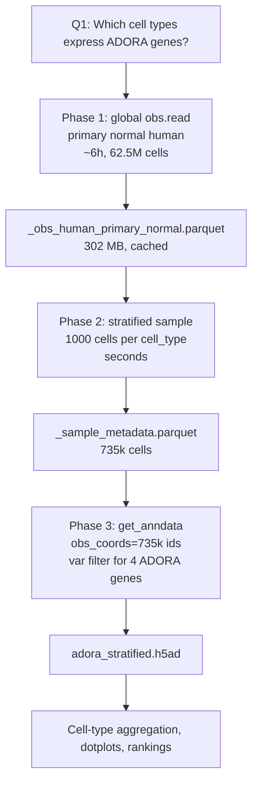

# Lab 001: Data Flow

## Summary

Lab 001 downloads a very small slice of a very large single-cell atlas: expression of four [ADORA](../concepts/adenosine-receptors.md) genes for a stratified cross-tissue sample of normal human cells.

The point is not to download every gene or every dataset. The point is to build a cell-type-by-receptor map that can seed later chromatin and perturbation analyses.

The script has gone through three iterations. The current one (**v3**) is documented in detail at [001 v3 stratified fetch](001-v3-stratified-fetch.md). This page provides the cross-iteration overview and history.

## Current Shape (V3)

V3's pipeline in one diagram:

Three things distinguish v3 from v1 and v2:

1. **Filter on the obs dimension, not on attribute columns.** `obs_coords=<soma_joinid list>` instead of `obs_value_filter="cell_type == ..."`. See [TileDB-SOMA storage](../concepts/tiledb-soma-storage.md) for why dimensions are fast and attributes are slow.
2. **Pay the obs scan exactly once.** The 6h scan result is cached as parquet; only Phase 3 reruns when we change the gene set or sample size.
3. **One X read for the whole dataset.** Not 186 calls (v1), not 898 calls (v2). One.

See [001 v3 stratified fetch](001-v3-stratified-fetch.md) for phase-by-phase details and observed costs.

## What V3 Downloads

| Layer | Filter |
|---|---|
| organism | `Homo sapiens` |
| obs filter (Phase 1 scan) | `is_primary_data == True and disease == 'normal'` |
| obs coords (Phase 3 fetch) | 735,583 sampled `soma_joinid` integers, stratified by `cell_type` |
| measurement | `RNA` |
| genes | `feature_name in ['ADORA1', 'ADORA2A', 'ADORA2B', 'ADORA3']` |

## What V3 Does Not Download

- all genes,
- raw FASTQ files,
- raw count outputs from every source study,
- ATAC-seq,
- histone ChIP-seq,
- methylation,
- disease cells,
- non-primary duplicate cells,
- the broader caffeine pathway gene set (CYP1A2, AHR, CREB1, NFAT, PDE4B/D, RYR1/2/3, HDAC4/5, etc.) — see the limitations section of [001 v3 stratified fetch](001-v3-stratified-fetch.md) for the planned expansion.

That restraint is intentional. Q1 only needs receptor expression.

## Output Schema

The deliverable is `cache/adora_stratified.h5ad`. As an AnnData object:

| Slot | Shape | Contents |
|---|---|---|
| `adata.X` | up to 735,583 × 4 | sparse expression for the four ADORA receptors |
| `adata.obs` | up to 735,583 × 7 | per-cell metadata, see table below |
| `adata.var` | 4 × N | gene metadata; index `feature_id` (Ensembl), `feature_name` is the symbol |

### Per-Cell Metadata Kept In `adata.obs`

| Column | Why it matters |
|---|---|
| `soma_joinid` | join key back to `_obs_human_primary_normal.parquet` |
| `cell_type` | primary grouping variable for the output |
| `tissue` | finer tissue label |
| `tissue_general` | broad tissue label that v3 stratified on |
| `assay` | which scRNA assay generated the cell |
| `dataset_id` | provenance back to the source study and its H5AD |
| `donor_id` | for later donor-aware summaries or QC |

## Cache Files (V3)

| File | Meaning | Size |
|---|---|---|
| `cache/_obs_human_primary_normal.parquet` | Phase 1 obs scan output | ~300 MB |
| `cache/_sample_metadata.parquet` | Phase 2 stratified sample | ~4 MB |
| `cache/adora_stratified.h5ad` | Phase 4 deliverable | < 100 MB expected |
| `cache/fetch.log` | human progress log | small, cumulative |
| `cache/stats.jsonl` | structured per-phase metrics | small, cumulative |
| `cache/_enumerate_brain.json` | leftover from v2 brain probe | safe to delete |

For the file schema and how `.h5ad` maps to `AnnData`, see [001 H5AD and AnnData cache](001-h5ad-anndata-cache.md).

## What the Matrix Values Mean

The downloaded values are RNA expression values in the Census-provided matrix for the selected cells and genes. The notebook then normalizes and aggregates them for a first-pass educational analysis.

Interpretation caution:

- single-cell RNA has dropout,
- low expression does not prove absence,
- cell type labels are harmonized but still inherit source-study variability,
- broad cell types can hide subtypes,
- receptor mRNA does not guarantee receptor protein abundance.

## Downstream Analysis

After downloading:

1. Normalize expression in the notebook.
2. Map Ensembl IDs to gene symbols.
3. Group by `cell_type`.
4. Compute mean expression and percent-expressing per receptor.
5. Plot dotplots.
6. Rank top cell types per receptor.
7. Identify cell types co-expressing multiple receptors.

---

## Appendix: V1 And V2 History

The original v1 script chunked by `dataset_id` per tissue and fetched one dataset at a time, with the rationale that each per-dataset slice would be a small recoverable chunk.

> **Empirical result (2026-05-31).** This chunking choice was wrong. Brain's first two datasets took 11h and 3h respectively before any checkpoint fired. Root cause: the Census X matrix is partitioned **cell-major**, so a per-dataset slice still pulls fragment data for all genes in those cells; the four-gene `var_value_filter` shrinks the answer but not the S3 traffic.

V2 replaced dataset chunking with `cell_type` chunking via `obs_value_filter`, hypothesizing that smaller obs filters would tighten the fragment set. The v2 probe (2026-06-01) instead confirmed that *any* attribute-based filter pays the full fragment-walk cost: a query for 11 cells took 10h 39m to return.

The combined evidence pointed to a single change: stop filtering on attributes, start filtering on the obs **dimension**. That is what v3 does. See [001 fetch stall post-mortem](001-fetch-stall-postmortem.md) for the full decision trail and [TileDB-SOMA storage](../concepts/tiledb-soma-storage.md) for the storage-layer reasoning.

Related pages: [001 v3 stratified fetch](001-v3-stratified-fetch.md), [CellxGene Census API](001-cellxgene-census-api.md), [H5AD and AnnData cache](001-h5ad-anndata-cache.md), [Lab 001 overview](001-adora-expression.md), [cell type response model](../concepts/cell-type-response-model.md), [TileDB-SOMA storage](../concepts/tiledb-soma-storage.md), [network and I/O instrumentation](../concepts/network-and-io-instrumentation.md), [001 fetch stall post-mortem](001-fetch-stall-postmortem.md)
