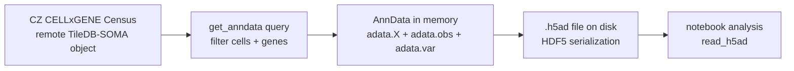

# Lab 001: H5AD and AnnData Cache

## Summary

Lab 001 uses the live [CellxGene Census API](001-cellxgene-census-api.md) to create local `.h5ad` cache files.

An `.h5ad` file is an **AnnData object saved to disk**. AnnData is the standard Python data container used by Scanpy-style single-cell workflows. H5AD uses **HDF5**, a hierarchical file format that stores arrays, tables, sparse matrices, and metadata inside one file.

Plain version:

> Census is the remote atlas. `get_anndata()` makes a local AnnData slice. `.write_h5ad()` freezes that slice as an HDF5-backed file so the notebook can reopen it without touching the network.

## Where the Cache Lives

The fetch script writes files under:

```text
lab/001_adora_expression/cache/
```

| File | Meaning |
|---|---|
| `adora_<tissue>.partial.h5ad` | in-progress checkpoint for a tissue |
| `adora_<tissue>.h5ad` | completed cache for one tissue |
| `adora_all_tissues.h5ad` | concatenation of completed per-tissue caches |
| `fetch.log` | log of dataset attempts, retries, failures, and completion |

The notebook should **read** these files. It should not run the live Census download unless you intentionally choose to do that.

## The Three Representations



## AnnData Schema

For this lab, the important AnnData slots are:

| Slot | Shape | Meaning |
|---|---:|---|
| `adata.X` | cells x genes | expression matrix for `ADORA1`, `ADORA2A`, `ADORA2B`, `ADORA3` |
| `adata.obs` | cells x metadata columns | one row per cell |
| `adata.var` | genes x metadata columns | one row per gene |
| `adata.uns` | unstructured metadata | optional analysis metadata |
| `adata.layers` | named cells x genes matrices | optional alternate expression matrices |
| `adata.obsm` | cells x embedding dimensions | optional cell embeddings |
| `adata.varm` | genes x annotation dimensions | optional gene-level arrays |

In our current cache, the practical core is:

```python
adata.X      # sparse expression matrix
adata.obs    # cell metadata
adata.var    # gene metadata
```

If `adata.shape == (200000, 4)`, read it as:

- 200,000 cells,
- 4 genes,
- each row is a cell,
- each column is an ADORA receptor gene.

## What Is Inside `adata.X`

`adata.X` is usually sparse for single-cell data. Sparse means the object stores mostly the nonzero entries instead of materializing a dense cells-by-genes table.

That matters because single-cell RNA data contain many zero values:

- true biological low expression,
- technical dropout,
- sampling limits,
- cell-state heterogeneity.

For Lab 001, `adata.X` contains the Census-provided RNA expression values for only four genes. We later aggregate those values by cell type.

## What Is Inside `adata.obs`

`obs` is the cell table. Each row corresponds to the same row in `adata.X`.

The fetch script keeps:

| Column | Meaning |
|---|---|
| `cell_type` | harmonized cell type label |
| `tissue` | specific tissue label |
| `tissue_general` | broad tissue label used for filtering |
| `assay` | assay technology from the source data |
| `dataset_id` | source dataset identity inside Census |
| `donor_id` | donor identity, useful for later donor-aware summaries |

This is the table that lets us ask:

- which cell types express `ADORA2A`?
- which tissues contain those cell types?
- which source datasets produced the signal?
- is a result dominated by one donor or one dataset?

## What Is Inside `adata.var`

`var` is the gene table. Each row corresponds to the same column in `adata.X`.

For this lab, `var` should describe the four selected genes:

```text
ADORA1
ADORA2A
ADORA2B
ADORA3
```

Depending on the Census version and export columns, gene metadata may include feature IDs, feature names, genome annotations, or measurement-specific identifiers.

## HDF5 Mental Model

HDF5 is a hierarchical container. It feels less like a CSV and more like a small filesystem inside one file.

Conceptually, an `.h5ad` file looks like:

```text
adora_brain.h5ad
├── X
│   ├── data
│   ├── indices
│   └── indptr
├── obs
│   ├── cell_type
│   ├── tissue
│   ├── tissue_general
│   ├── assay
│   ├── dataset_id
│   └── donor_id
├── var
│   └── gene metadata
├── uns
├── layers
├── obsm
└── varm
```

The exact low-level layout can vary, especially for sparse matrices and categorical columns. The important point is that `anndata.read_h5ad()` knows how to reconstruct the Python AnnData object from that hierarchy.

## How Census Provides the AnnData

The Census itself is not an `.h5ad` file per query. It is a remote, versioned TileDB-SOMA object with (see [TileDB-SOMA storage](../concepts/tiledb-soma-storage.md) for the on-disk layout):

- organism-level experiments,
- measurements such as RNA,
- an observation axis for cells,
- a variable axis for genes/features,
- one or more matrix layers.

`get_anndata()` is a convenience function that:

1. opens the Census object,
2. filters `obs` for cells,
3. filters `var` for genes,
4. slices the expression matrix,
5. downloads/materializes that slice,
6. returns an in-memory AnnData object.

In our script, the call means:

```python
cellxgene_census.get_anndata(
    census=census,
    organism="Homo sapiens",
    measurement_name="RNA",
    var_value_filter="feature_name in ['ADORA1','ADORA2A','ADORA2B','ADORA3']",
    obs_value_filter="tissue_general == 'brain' and disease == 'normal'",
    obs_column_names=["cell_type", "tissue", "tissue_general", "assay", "dataset_id", "donor_id"],
)
```

This does not download the whole Census. It downloads the requested slice. But the cell slice can still be large, so it belongs in the fetch script rather than the interactive notebook.

## How the Script Decides What to Reuse

The fetch script uses a simple local-file cache policy:

```python
if cache/adora_<tissue>.h5ad exists:
    skip that tissue
elif cache/adora_<tissue>.partial.h5ad exists:
    resume from the partial checkpoint
else:
    query Census for that tissue
```

This is **not** automatic caching by the Census API. It is our project-level cache.

So:

- `cellxgene_census.get_anndata()` will query the remote Census when called.
- `anndata.read_h5ad("cache/adora_brain.h5ad")` reads the local file and uses no network.
- the notebook should prefer `read_h5ad()`.
- the fetch script is the only place that should do large live downloads.

## Space Expectations

The cache size depends mostly on:

- number of cells,
- number of metadata columns,
- string/categorical metadata overhead,
- whether the expression matrix is sparse,
- whether both per-tissue and combined caches are kept.

Even though there are only four genes, a tissue with many cells still carries a large `obs` table. Peak disk use is roughly:

```text
per-tissue caches + combined cache + one partial checkpoint + fetch.log
```

For Lab 001, this should be much smaller than an all-gene single-cell download, but it is still worth starting with one tissue.

## Useful Inspection Commands

From the project root:

```bash
du -sh lab/001_adora_expression/cache
find lab/001_adora_expression/cache -maxdepth 1 -type f -printf '%10s  %p\n' | sort -n
```

From Python:

```python
import anndata as ad

adata = ad.read_h5ad("cache/adora_brain.h5ad")
adata.shape
adata.obs.head()
adata.var.head()
adata.X
```

Related pages: [CellxGene Census API](001-cellxgene-census-api.md), [data flow](001-data-flow.md), [notebook guide](001-notebook-guide.md), [Lab 001 overview](001-adora-expression.md), [TileDB-SOMA storage](../concepts/tiledb-soma-storage.md), [001 fetch stall post-mortem](001-fetch-stall-postmortem.md)
